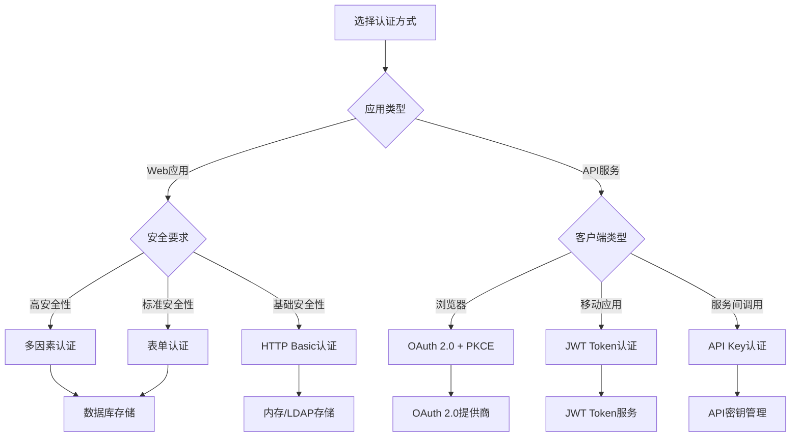

# Spring Security 用户认证

Spring Security 提供了多种用户认证方式



### 1. HTTP Basic 认证
简单的HTTP协议认证

特点: 浏览器弹窗，凭证通过Authorization头传输
适用场景: REST API、简单的内部系统
配置示例
```
http.httpBasic(Customizer.withDefaults());
```

### 2. 表单认证（Form-based Authentication）
最常用的Web应用认证方式

特点: 自定义登录页面，使用Session管理认证状态
适用场景: 传统的Web应用程序
配置示例

```
http.formLogin(form -> form
    .loginPage("/login")
    .loginProcessingUrl("/auth/login")
    .defaultSuccessUrl("/dashboard")
);
```

### 3. 单因素认证与多因素认证
结合单种或多种认证因素

- 用户名/密码
- 手机验证码
- 生物识别(人脸、指纹等)


### 4. OAuth 2.0 认证
第三方授权认证

```java
@EnableWebSecurity
public class OAuth2SecurityConfig {
    @Bean
    public SecurityFilterChain filterChain(HttpSecurity http) throws Exception {
        http.oauth2Login(oauth2 -> oauth2
            .loginPage("/login")
            .defaultSuccessUrl("/dashboard")
        );
        return http.build();
    }
}
```

### 5. JWT Token 认证

```java
@Component
public class JwtAuthenticationTokenFilter extends OncePerRequestFilter {

    @Resource
    private LocalCacheService localCacheService;

    @Override
    protected void doFilterInternal(HttpServletRequest request, HttpServletResponse response, FilterChain filterChain) throws ServletException, IOException {
        //1.在请求头中获取token
        String token = request.getHeader("token");
        //2.解析token获取用户id
        //3.在redis中获取用户信息
        //4.将获取到的用户信息存入SecurityContextHolder 参数（用户信息，，权限信息）
        //5.放行
    }
}
```