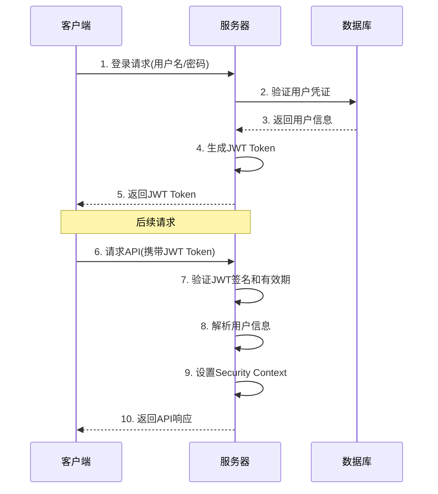

# Spring Security JWT Token认证

## 认证流程



## JWT结构
`Header.Payload.Signature`

- Header: 指定签名算法
- Payload: 消息体，包括用户信息及过期时间等
- Signature: 签名，根据Header中指定的算法生成

## Spring Boot 集成

### 引入依赖

```xml
<dependencies>
    <dependency>
        <groupId>org.springframework.boot</groupId>
        <artifactId>spring-boot-starter-web</artifactId>
    </dependency>

    <dependency>
        <groupId>org.springframework.boot</groupId>
        <artifactId>spring-boot-starter-security</artifactId>
    </dependency>

    <dependency>
        <groupId>org.springframework.boot</groupId>
        <artifactId>spring-boot-starter-data-jpa</artifactId>
    </dependency>

    <dependency>
        <groupId>com.mysql</groupId>
        <artifactId>mysql-connector-j</artifactId>
    </dependency>

    <dependency>
        <groupId>org.projectlombok</groupId>
        <artifactId>lombok</artifactId>
    </dependency>

    <dependency>
        <groupId>io.jsonwebtoken</groupId>
        <artifactId>jjwt</artifactId>
        <version>0.9.0</version>
    </dependency>

    <dependency>
        <groupId>javax.xml.bind</groupId>
        <artifactId>jaxb-api</artifactId>
        <version>2.3.1</version>
    </dependency>

    <!-- 生产环境替换为Redis -->
    <dependency>
        <groupId>com.google.guava</groupId>
        <artifactId>guava</artifactId>
        <version>33.5.0-jre</version>
    </dependency>
</dependencies>
```

### 数据库连接配置

```yaml
spring:
  datasource:
    url: jdbc:mysql://localhost:3306/dbname
    username: root
    password: root
    driver-class-name: com.mysql.jdbc.Driver
  jpa:
    hibernate:
      ddl-auto: validate
    show-sql: true
```

### 创建用户表
```mysql
CREATE TABLE `sys_user`(
    `id` VARCHAR(32) NOT NULL PRIMARY KEY COMMENT 'id',
    `username` VARCHAR(100) NOT NULL,
    `password` VARCHAR(255) NOT NULL,
    `enabled` BOOLEAN NOT NULL COMMENT '用户是否可用',
    `roles` VARCHAR(255) COMMENT '用户角色',
    `email` VARCHAR(255) COMMENT '邮箱',
    `create_time` TIMESTAMP NOT NULL DEFAULT CURRENT_TIMESTAMP COMMENT '创建时间',
    `update_time` TIMESTAMP NOT NULL DEFAULT CURRENT_TIMESTAMP COMMENT '更新时间'
)COMMENT='用户详情表';

CREATE UNIQUE INDEX `username_index` USING BTREE ON `sys_user`(`username`);
```

### 用户实体类与持久层

```java
@Data
@Entity
@Table(name = "sys_user")
public class SysUserDO {
    @Id
    private String id;
    private String username;
    private String password;
    private Boolean enabled;
    private String roles;
    private String email;
    private LocalDateTime createTime;
    private LocalDateTime updateTime;
}
```

```java
@Repository
public interface SysUserRepository extends JpaRepository<SysUserDO, String> {
    SysUserDO findByUsername(String username);
}
```

### 自定义用户认证

```java
@Data
@NoArgsConstructor
@AllArgsConstructor
public class LoginUser implements UserDetails {

    private SysUserDO sysUserDO;

    @Override
    public Collection<? extends GrantedAuthority> getAuthorities() {
        return Arrays.stream(sysUserDO.getRoles().split(","))
                .filter(StringUtils::hasLength)
                .map(SimpleGrantedAuthority::new)
                .collect(Collectors.toList());
    }

    @Override
    public String getPassword() {
        return sysUserDO.getPassword();
    }
    @Override
    public String getUsername() {
        return sysUserDO.getUsername();
    }
    @Override
    public boolean isAccountNonExpired() {
        return true;
    }
    @Override
    public boolean isAccountNonLocked() {
        return true;
    }
    @Override
    public boolean isCredentialsNonExpired() {
        return true;
    }
    @Override
    public boolean isEnabled() {
        return sysUserDO.getEnabled();
    }
}
```

注意点：在Spring Security Config中角色配置如下`ADMIN`,`USER`,而在数据库中需要`ROLE_`前缀

```java
@Component
public class UserDetailsServiceImpl implements UserDetailsService {

    @Resource
    private SysUserRepository sysUserRepository;

    @Override
    public UserDetails loadUserByUsername(String username) throws UsernameNotFoundException {
        SysUserDO sysUserDO = sysUserRepository.findByUsername(username);
        if (sysUserDO == null) {
            throw new UsernameNotFoundException("用户不存在");
        }
        LoginUser loginUser = new LoginUser();
        loginUser.setSysUserDO(sysUserDO);
        return loginUser;
    }

    /**
     * 获取已登录用户
     * @return LoginUser
     */
    public LoginUser obtainLoginUser() {
        final Authentication authentication = SecurityContextHolder.getContext().getAuthentication();
        if (authentication.getPrincipal() instanceof LoginUser) {
            return (LoginUser) authentication.getPrincipal();
        }
        return null;
    }
}
```

### 自定义JWT工具类

```java
/**
 * JWT工具类
 */
public class JwtUtils {
    /** 有效期为 1小时 */
    public static final Long JWT_TTL = 60 * 60 * 1000L;
    /** 设置秘钥明文 */
    public static final String JWT_KEY = "JWTUniqueKey";

    public static String getUUID() {
        return UUID.randomUUID().toString().replaceAll("-", "");
    }

    /**
     * 生成jtw
     *
     * @param subject token中要存放的数据（json格式）
     * @return
     */
    public static String createJwt(String subject) {
        // 设置过期时间
        JwtBuilder builder = getJwtBuilder(subject, null, getUUID());
        return builder.compact();
    }

    /**
     * 生成jtw
     *
     * @param subject   token中要存放的数据（json格式）
     * @param ttlMillis token超时时间
     * @return
     */
    public static String createJwt(String subject, Long ttlMillis) {
        JwtBuilder builder = getJwtBuilder(subject, ttlMillis, getUUID());// 设置过期时间
        return builder.compact();
    }

    private static JwtBuilder getJwtBuilder(String subject, Long ttlMillis,
                                            String uuid) {
        SignatureAlgorithm signatureAlgorithm = SignatureAlgorithm.HS256;
        SecretKey secretKey = generalKey();
        long nowMillis = System.currentTimeMillis();
        Date now = new Date(nowMillis);
        if (ttlMillis == null) {
            ttlMillis = JwtUtils.JWT_TTL;
        }
        long expMillis = nowMillis + ttlMillis;
        Date expDate = new Date(expMillis);
        return Jwts.builder()
                .setId(uuid)
                .setSubject(subject)
                .setIssuer("sg")
                .setIssuedAt(now)
                .signWith(signatureAlgorithm, secretKey)
                .setExpiration(expDate);
    }

    /**
     * 创建token
     *
     * @param id
     * @param subject
     * @param ttlMillis
     * @return
     */
    public static String createJwt(String id, String subject, Long ttlMillis) {
        // 设置过期时间
        JwtBuilder builder = getJwtBuilder(subject, ttlMillis, id);
        return builder.compact();
    }

    /**
     * 生成加密后的秘钥 secretKey
     *
     * @return
     */
    public static SecretKey generalKey() {
        byte[] encodedKey = Base64.getDecoder().decode(JwtUtils.JWT_KEY);
        SecretKey key = new SecretKeySpec(encodedKey, 0, encodedKey.length,
                "AES");
        return key;
    }

    /**
     * 解析JWT
     */
    public static Claims parseJwt(String jwt) throws Exception {
        SecretKey secretKey = generalKey();
        return Jwts.parser()
                .setSigningKey(secretKey)
                .parseClaimsJws(jwt)
                .getBody();
    }
}
```

### 自定义本地缓存
生产环境推荐 Redis

```java
public class BaseConstants {
    public static final Cache<String, LoginUser> LOCAL_USER_CACHE = CacheBuilder.newBuilder()
            // 设置缓存最大容量
            .maximumSize(10000)
            // 设置写入后60分钟过期
            .expireAfterWrite(60, TimeUnit.MINUTES)
            // 设置访问后30分钟过期
            .expireAfterAccess(30, TimeUnit.MINUTES)
            // 开启缓存统计信息
            .recordStats()
            .build();
}
```

### 自定义公共响应体

```java
@Data
public class ResponseVO<T> {
    private Integer code;
    private String msg;
    private T data;

    public ResponseVO() {
    }

    public ResponseVO(Integer code, String msg, T data) {
        this.code = code;
        this.msg = msg;
        this.data = data;
    }

    public static <T> ResponseVO<T> success() {
        return new ResponseVO<>(0, "success", null);
    }

    public static <T> ResponseVO<T> success(T data) {
        return new ResponseVO<>(0, "success", data);
    }

    public static <T> ResponseVO<T> error(Integer code, String msg) {
        return new ResponseVO<>(code, msg, null);
    }
}
```

### 自定义登录登出

请求体结构
```java
@Data
public class AuthLoginReqVO {
    private String username;
    private String password;
}
```


```java
@Slf4j
@Controller
@RequestMapping("auth")
public class AuthController {

    @Resource
    private AuthenticationManager authenticationManager;

    @PostMapping("login")
    @ResponseBody
    public ResponseVO login(@RequestBody AuthLoginReqVO authLoginReqVO) {
        // 手动进行认证
        Authentication authentication = authenticationManager.authenticate(
                new UsernamePasswordAuthenticationToken(
                        authLoginReqVO.getUsername(),
                        authLoginReqVO.getPassword()
                )
        );

        // 设置认证信息到安全上下文
        SecurityContextHolder.getContext().setAuthentication(authentication);

        // 获取用户详细信息
        LoginUser loginUser = (LoginUser) authentication.getPrincipal();

        String userId = loginUser.getSysUserDO().getId();
        // 认证通过生成token
        String jwt = JwtUtils.createJwt(userId);
        // 用户信息存入缓存 生产环境推荐 Redis
        BaseConstants.LOCAL_USER_CACHE.put("login:" + userId, loginUser);
        // 把token返回给前端
        Map<String, String> tokenMap = Collections.singletonMap("token", jwt);

        log.info("用户登录成功: {} - userId: {}",
                authLoginReqVO.getUsername(), userId);
        return ResponseVO.success(tokenMap);
    }

    /**
     * 自定义退出登录接口
     */
    @GetMapping("/logout")
    @ResponseBody
    public ResponseVO<String> logout() {
        //获取SecurityContextHolder中的用户id
        Authentication authentication = SecurityContextHolder.getContext().getAuthentication();
        LoginUser loginUser = (LoginUser) authentication.getPrincipal();
        String userId = loginUser.getSysUserDO().getId();
        //删除缓存中的用户信息
        BaseConstants.LOCAL_USER_CACHE.invalidate("login:" + userId);
        return ResponseVO.success();
    }
}
```

### 自定义认证过滤器

```java
@Component
public class JwtAuthenticationTokenFilter extends OncePerRequestFilter {
    @Override
    protected void doFilterInternal(HttpServletRequest request, HttpServletResponse response, FilterChain filterChain) throws ServletException, IOException {
        //1.在请求头中获取token
        String token = request.getHeader("token");

        // 此处需要判断token是否为空
        if (!StringUtils.hasText(token)){
            // 没有token放行 此时的SecurityContextHolder没有用户信息 会被后面的过滤器拦截
            filterChain.doFilter(request,response);
            return;
        }

        //2.解析token获取用户id
        String subject;
        try {
            Claims claims = JwtUtils.parseJwt(token);
            subject = claims.getSubject();
        } catch (Exception e) {
            // 解析异常
            throw new RuntimeException("invalid token");
        }
        //3.在缓存中获取用户信息
        String redisKey = "login:" + subject;
        LoginUser loginUser = BaseConstants.LOCAL_USER_CACHE.getIfPresent(redisKey);

        //此处需要判断loginUser是否为空
        if (Objects.isNull(loginUser)){
            throw new RuntimeException("用户未登录");
        }
        //4.将获取到的用户信息存入SecurityContextHolder 参数（用户信息，，权限信息）
        UsernamePasswordAuthenticationToken authenticationToken = new UsernamePasswordAuthenticationToken(loginUser, null, null);
        SecurityContextHolder.getContext().setAuthentication(authenticationToken);

        //5.放行
        filterChain.doFilter(request,response);
    }
}
```

### 自定义认证、授权失败处理器

```java
@Slf4j
@Controller
public class AuthenticationEntryPointHandler implements AuthenticationEntryPoint {

    @Override
    public void commence(HttpServletRequest request,
                         HttpServletResponse response,
                         AuthenticationException authException) throws IOException {
        response.setContentType("application/json;charset=UTF-8");
        response.setStatus(HttpStatus.UNAUTHORIZED.value());
        response.getWriter().write(
                "{\"code\": 401, \"msg\": \"未认证，请先登录\"}"
        );
    }
}
```

```java
@Component
public class AccessDeniedHandlerImpl implements AccessDeniedHandler {
    @Override
    public void handle(HttpServletRequest request, HttpServletResponse response,
                       AccessDeniedException accessDeniedException) throws IOException,
            ServletException {
        response.setContentType("application/json;charset=UTF-8");
        response.setStatus(HttpStatus.FORBIDDEN.value());
        response.getWriter().write(
                "{\"code\": 401, \"msg\": \"权限不足\"}"
        );
    }
}
```

### Spring Security 配置

```java
@Configuration
@EnableWebSecurity
public class SecurityConfig {
    @Resource
    AuthenticationConfiguration authenticationConfiguration;
    @Resource
    JwtAuthenticationTokenFilter jwtAuthenticationTokenFilter;
    @Resource
    AccessDeniedHandlerImpl accessDeniedHandler;
    @Resource
    AuthenticationEntryPointHandler authenticationEntryPoint;

    @Bean
    public PasswordEncoder passwordEncoder() {
        return new BCryptPasswordEncoder();
    }

    @Bean
    public AuthenticationManager authenticationManagerBean() throws Exception {
        return authenticationConfiguration.getAuthenticationManager();
    }

    /**
     * 配置Spring Security的过滤链。
     *
     * @param http 用于构建安全配置的HttpSecurity对象。
     * @return 返回配置好的SecurityFilterChain对象。
     * @throws Exception 如果配置过程中发生错误，则抛出异常。
     */
    @Bean
    SecurityFilterChain securityFilterChain(HttpSecurity http) throws Exception {
        http
                // 设置会话创建策略为无状态
                .sessionManagement(session -> session
                        .sessionCreationPolicy(SessionCreationPolicy.STATELESS)
                )
                // 配置授权规则
                .authorizeHttpRequests(authorize -> authorize
                        .requestMatchers("/static/css/**", "/static/js/**", "/static/images/**").permitAll()
                        .requestMatchers("/auth/login", "/auth/register", "/auth/logout").permitAll()
                        .requestMatchers("/admin/**").hasRole("ADMIN")
                        .requestMatchers("/user/**").hasAnyRole("USER", "ADMIN")
                        .anyRequest().authenticated()
                )
                //开启跨域访问
                .cors(AbstractHttpConfigurer::disable)
                // 禁用CSRF保护
                .csrf(AbstractHttpConfigurer::disable)
                // 添加JWT认证过滤器
                .addFilterBefore(jwtAuthenticationTokenFilter, UsernamePasswordAuthenticationFilter.class)
                // 配置异常处理
                .exceptionHandling(exception -> exception
                        .authenticationEntryPoint(authenticationEntryPoint)
                        .accessDeniedHandler(accessDeniedHandler)
                );
        // 构建并返回安全过滤链
        return http.build();
    }
}
```

### 自定义测试接口

```java
@RestController
public class IndexController {
    @GetMapping("/index")
    public ResponseVO<String> index() {
        return ResponseVO.success("index");
    }
}
```

```shell
GET http://localhost:8080/index

POST http://localhost:8080/auth/login
```