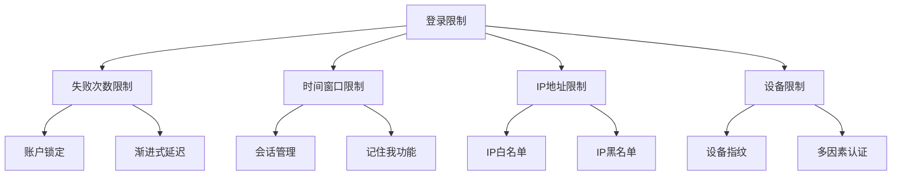

# Spring Spring Security 登录限制




## 失败次数限制
基于guava实现本地缓存，生产环境仅替换为Redis即可

### 引入依赖
```xml
<dependency>
    <groupId>com.google.guava</groupId>
    <artifactId>guava</artifactId>
    <version>33.5.0-jre</version>
</dependency>
```

### LoginAttemptService

```java
@Service
public class LoginAttemptService {
    // 最大尝试次数
    private static final int MAX_ATTEMPT = 5;
    // 锁定时间30分钟
    private static final long BLOCK_DURATION = 30 * 60;

    private static final Cache<String, Integer> attemptCache = CacheBuilder.newBuilder()
            // 最大缓存条目数
            .maximumSize(1000)
            // 30分钟过期
            .expireAfterWrite(BLOCK_DURATION, TimeUnit.MINUTES)
            .build();

    private static final String ATTEMPT_KEY_PREFIX = "login_attempt:";
    private static final String BLOCK_KEY_PREFIX = "user_blocked:";

    public void loginFailed(String username) {
        String attemptKey = ATTEMPT_KEY_PREFIX + username;
        String blockKey = BLOCK_KEY_PREFIX + username;

        Integer attempts = attemptCache.getIfPresent(attemptKey);
        if (attempts == null) {
            attempts = 0;
        }
        attempts ++;
        attemptCache.put(attemptKey, attempts);

        // 检查是否需要锁定
        if (attempts >= MAX_ATTEMPT) {
            attemptCache.put(blockKey, 1);
        }
    }

    public void loginSucceeded(String username) {
        String attemptKey = ATTEMPT_KEY_PREFIX + username;
        String blockKey = BLOCK_KEY_PREFIX + username;

        attemptCache.invalidate(attemptKey);
        attemptCache.invalidate(blockKey);
    }

    public boolean isBlocked(String username) {
        String blockKey = BLOCK_KEY_PREFIX + username;
        return attemptCache.getIfPresent(blockKey) != null;
    }

    public int getRemainingAttempts(String username) {
        String attemptKey = ATTEMPT_KEY_PREFIX + username;
        Integer attempts = attemptCache.getIfPresent(attemptKey);
        return attempts != null ? MAX_ATTEMPT - attempts : MAX_ATTEMPT;
    }
}
```

### 认证失败处理器

```java
@Component
public class CustomAuthenticationFailureHandler implements AuthenticationFailureHandler {
    @Resource
    private LoginAttemptService loginAttemptService;

    public CustomAuthenticationFailureHandler(LoginAttemptService loginAttemptService) {
        this.loginAttemptService = loginAttemptService;
    }

    @Override
    public void onAuthenticationFailure(HttpServletRequest request,
                                        HttpServletResponse response,
                                        AuthenticationException exception) throws IOException {

        String username = request.getParameter("username");
        String redirectUrl = "/auth/login?error";

        if (username != null) {
            loginAttemptService.loginFailed(username);

            if (loginAttemptService.isBlocked(username)) {
                redirectUrl += "=blocked";
            } else {
                int remaining = loginAttemptService.getRemainingAttempts(username);
                redirectUrl += "=attempts&remaining=" + remaining;
            }
        }
        response.sendRedirect(redirectUrl);
    }
}
```

### 认证成功处理器

```java
@Component
public class CustomAuthenticationSuccessHandler extends SimpleUrlAuthenticationSuccessHandler {
    @Resource
    private LoginAttemptService loginAttemptService;

    public CustomAuthenticationSuccessHandler(LoginAttemptService loginAttemptService) {
        this.loginAttemptService = loginAttemptService;
    }

    @Override
    public void onAuthenticationSuccess(HttpServletRequest request,
                                        HttpServletResponse response,
                                        Authentication authentication) throws IOException, ServletException {

        String username = authentication.getName();
        loginAttemptService.loginSucceeded(username);

        super.onAuthenticationSuccess(request, response, authentication);
    }
}
```

### 改造用户认证

```java
@Service
public class UserDetailsServiceImpl implements UserDetailsService {

    @Resource
    private SysUserRepository sysUserRepository;

    @Resource
    private LoginAttemptService loginAttemptService;

    @Override
    public UserDetails loadUserByUsername(String username) throws UsernameNotFoundException {
        // 新增用户锁定校验
        if (loginAttemptService.isBlocked(username)) {
            throw new LockedException(String.format("user %s is blocked", username));
        }

        SysUserDO sysUserDO = sysUserRepository.findByUsername(username);
        if (sysUserDO == null) {
            throw new UsernameNotFoundException(String.format("user %s not found", username));
        }

        LoginUser loginUser = new LoginUser(sysUserDO);
        return loginUser;
    }
}
```

### 安全配置类

```java
@Configuration
@EnableWebSecurity
public class SecurityConfig {

    @Resource
    private CustomAuthenticationFailureHandler customAuthenticationFailureHandler;
    @Resource
    private CustomAuthenticationSuccessHandler customAuthenticationSuccessHandler;

    /**
     * 密码编码器配置
     * @return PasswordEncoder
     */
    @Bean
    public PasswordEncoder passwordEncoder() {
        return new BCryptPasswordEncoder();
    }

    @Bean
    public SecurityFilterChain securityFilterChain(HttpSecurity http) throws Exception {
        http
                .authorizeHttpRequests(authorize -> authorize
                        .requestMatchers("/static/css/**", "/static/js/**", "/static/images/**").permitAll()
                        .requestMatchers("/auth/login", "/auth/register").permitAll()
                        .anyRequest().authenticated()
                )
                .formLogin(form -> form
                        // 自定义登陆页面
                        .loginPage("/auth/login")
                        // 登陆表单提交的URL
                        .loginProcessingUrl("/auth/login")
                        // 登录成功后重定向的URL
                        .defaultSuccessUrl("/index", true)
                        // 登录失败后重定向的URL
                        .failureUrl("/auth/login?error=true")
                        // 登录失败处理类
                        .failureHandler(customAuthenticationFailureHandler)
                        // 登录成功处理类
                        .successHandler(customAuthenticationSuccessHandler)
                        // 允许所有人访问登录页面
                        .permitAll()
                )
                .logout(logout -> logout
                        // 退出登录的URL
                        .logoutUrl("/auth/logout")
                        // 退出登录后跳转的URL
                        .logoutSuccessUrl("/auth/login?logout=true")
                        // 使当前Session失效
                        .invalidateHttpSession(true)
                        // 删除JSESSIONID cookie
                        .deleteCookies("JSESSIONID")
                        // 允许所有人访问退出登录
                        .permitAll()
                )
                .sessionManagement(session -> session
                        // 每个用户最多允许1个活跃会话
                        .maximumSessions(1)
                        // 覆盖登录
                        .maxSessionsPreventsLogin(false)
                        // 会话过期后跳转的URL
                        .expiredUrl("/auth/login?expired=true")
                )
                .rememberMe(remember -> remember
                        // 加密密钥
                        .key("uniqueSecretKey")
                        // 参数名，与前端传参一致
                        .rememberMeParameter("remember")
                        // token有效期30天
                        .tokenValiditySeconds(3600 * 24 * 30)
                )
                .csrf(AbstractHttpConfigurer::disable);
        return http.build();
    }
}
```