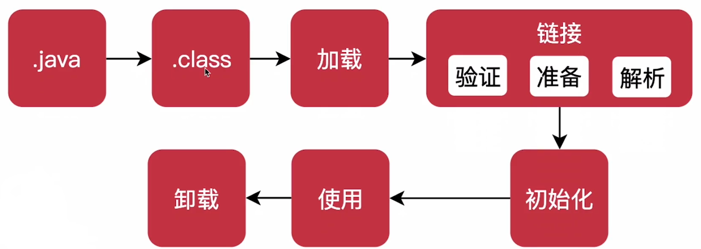

# 类加载过程




## 加载

1. 读取类的二进制字节流
2. 转为方法区的数据结构，并存放至方法区
3. 在Java堆中创建java.lang.Class 对象，作为操作方法区类数据的访问入口

## 链接

### 验证

class文件格式校验

1. 文件格式验证
2. 元数据验证
3. 字节码验证
4. 符号引用验证

### 准备

初始化类变量(这里需要和实例变量做区分)，数据类型变量零值

### 解析

解析阶段是虚拟机将常量池内的符号引用替换为直接引用的过程  
符号引用:类和方法的全限定名,例如java.lang.String;字段的名称、描述和方法的名称、描述.  
直接引用:指向目标对象的内存地址,相对偏移量或一个能间接定位到目标的句柄

### 初始化

初始化就是执行类的构造器方法init()的过程。  
这个方法不需要定义，是javac编译器自动收集类中所有类变量的赋值动作和静态代码块中的语句合并来的。
这里要与实例初始化区分，类初始化只运行一次。


## 构造函数、构造代码块、静态代码块
### 构造函数
```
public Hello(){
	
}
```
关于构造函数，以下几点要注意：

1. 对象一建立，就会调用与之相应的构造函数，也就是说，不建立对象，构造函数时不会运行的。
2. 构造函数的作用是用于给对象进行初始化。
3. 一个对象建立，构造函数只运行一次，而一般方法可以被该对象调用多次。

### 构造代码块
```
{//构造代码块

}
```
关于构造代码块，以下几点要注意：

1. 构造代码块的作用是给对象进行初始化。
2. 对象一建立就运行构造代码块了，而且优先于构造函数执行。这里要强调一下，有对象建立，才会运行构造代码块，类不能调用构造代码块的，而且构造代码块与构造函数的执行顺序是前者先于后者执行。
3. 构造代码块与构造函数的区别是：构造代码块是给所有对象进行统一初始化，而构造函数是给对应的对象初始化，因为构造函数是可以多个的，运行哪个构造函数就会建立什么样的对象，但无论建立哪个对象，都会先执行相同的构造代码块。也就是说，构造代码块中定义的是不同对象共性的初始化内容。

### 静态代码块
```
static {
	// 静态代码块
}
```
关于静态代码块，要注意的是：

1. 它是随着类的加载而执行，只执行一次，并优先于主函数。具体说，静态代码块是由类调用的。类调用时，先执行静态代码块，然后才执行主函数的。
2. 静态代码块其实就是给类初始化的，而构造代码块是给对象初始化的。
3. 静态代码块中的变量是局部变量，与普通函数中的局部变量性质没有区别。
4. 一个类中可以有多个静态代码块