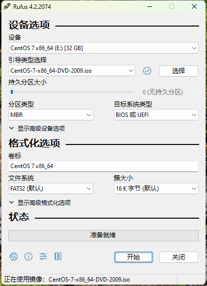

# Centos7安装部署

## 安装步骤

### 下载系统镜像

清华源镜像: https://mirrors.tuna.tsinghua.edu.cn  点击**获取下载链接**  
选择`CentOS7 (x86_64, DVD)`

### 启动盘制作

使用Rufus制作启动盘，选择镜像文件，分区类型以及目标系统类型我们默认即可，点击开始。



### 开始安装

1. Install Centos 7
2. 语言这里选择 English
3. Date & Time 选择中国
4. 键盘选择 English
5. SOFTWARE SELECTION 选择最小化安装
6. INSTALLATION DESTINATION 分区选择自动配置
7. ROOT PASSWORD 输入root账号密码
8. 等待安装完成...


### 配置阿里云yum源

1. 打开centos的yum文件夹 `cd /etc/yum.repos.d/`
2. 下载repo文件 `curl http://mirrors.aliyun.com/repo/Centos-7.repo -o Centos-7.repo`
3. 备份系统原来的repo文件 `mv CentOS-Base.repo CentOS-Base.repo.bak`
4. 替换系统repo文件 `mv Centos-7.repo CentOS-Base.repo`
5. 执行yum源更新命令
   ```shell
   yum clean all
   yum macache
   yum -y update
   ```

### 设置静态IP
1. 查看主机网络信息`ifconfig`，其中IP地址为inet，子网掩码为netmask
2. 查看网关地址 `route -n`
3. 设置静态IP `vim /etc/sysconfig/network-scripts/ifcfg-ens192`
   ```shell
   BOOTPROTO=static
   ONBOOT=yes
   IPADDR=192.168.1.101
   NETMASK=255.255.255.0
   GATEWAY=192.168.1.1
   DNS1=114.114.114.114
   DNS2=8.8.8.8
   ```
4. 重启网卡 `systemctl restart network`

### 设置主机名

```shell
vim /etc/hosts

127.0.0.1 localhost localhost.localdomain
192.168.1.101 hadoop101
192.168.1.102 hadoop102
192.168.1.103 hadoop103
```

### 关闭防火墙

```shell
systemctl stop firewalld

systemctl disable firewalld
```