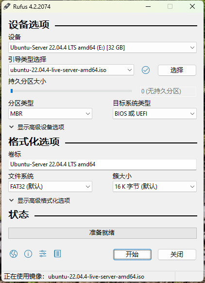

# Ubuntu安装部署

## 安装步骤

### 下载系统镜像

官网地址: https://ubuntu.com/download  
清华源镜像: https://mirrors.tuna.tsinghua.edu.cn  点击**获取下载链接**  
这里需要区分 `Ubuntu Desktop` 和 `Ubuntu Server`，对应桌面版本和服务器版本，我们选择服务器版本 `22.04.4 (amd64, Server)`

### 启动盘制作

使用Rufus制作启动盘，选择镜像文件，分区类型以及目标系统类型我们默认即可，点击开始。

### 开始安装

1. Try or Install Ubuntu Server
2. 语言这里选择 English
3. 键盘 Keyboard 也选择 English
4. Choose type of install: 这里选择最小化安装
5. Network connections: 这里选择默认，如果需要固定IP地址，也可以选择手动输入
6. Configure proxy: 选择默认
7. Configure Ubuntu archive mirror: 选择默认(可以在安装完成后自行替换国内镜像仓库地址)
8. Guided storage configuration: 选择默认，使用整个磁盘LVM逻辑分区
9. Storage configuration: 选择默认，弹窗提示这将会格式化整个磁盘，选择continue即可
10. Profile setup: 设置服务名称和用户名密码(Ubuntu的默认root密码是随机的，即每次开机都有一个新的root密码，可以在安装成功后通过`sudo passwd`命令设置)
11. SSH setup: 选择默认，安装OpenSSH server
12. Feature Server Snaps: 选择默认，这些依赖包可以在自行用`apt-get`命令安装
13. 等待安装完成...

注意点:  
如果出现 `[FAILED] Failed unmounting /cdrom`报错，重启服务并移除U盘，否则将会尝试重新安装