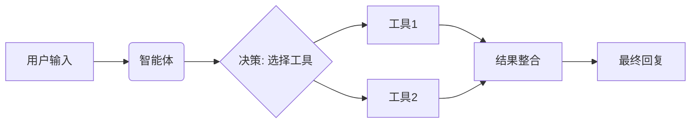

# 智能体及工具

## 基本定义

- 智能体是一个具备决策能力的LLM(大语言模型)模块，它可以根据用户输入动态选择并调用合适的工具(Tools)来完成任务
- 核心思想:将LLM作为“大脑”，通过工具扩展其能力(如搜索、计算、数据库查询等)
- 工具是智能体可调用的函数或API，用于执行LLM本身无法直接完成的任务(如实时数据获取、数学计算等)
- 每个工具需明确  
  1. 名称(name): 工具的标识符
  2. 描述(description): 说明工具功能，用于LLM决策
  3. 函数(function): 具体执行的逻辑

## 工作流程


## 工具

LangChain提供多种预设工具，例如：

1. GoogleSearchRun：执行谷歌搜索
2. Calculator：数学计算
3. PythonREPLTool：运行Python代码
4. FileManagementTool：文件操作

自定义工具类型

```python
from langchain.tools import tool

@tool
def get_weather(city: str) -> str:
  """获取指定城市的天气信息。输入应该是城市名称。"""
  return f"{city}天气：晴，25℃"

@tool
def calc_travel_time(query: str) -> str:
  """
  计算两个城市之间的行程时间。
  输入格式：[起始城市]到[目的城市]
  示例：北京到上海
  """
  if "到" in query:
    # 简单提取城市
    parts = query.split("到")
    if len(parts) == 2:
      start, end = parts[0].strip(), parts[1].strip()
      return f"从{start}到{end}需要5小时"
  return "请使用格式：[起始城市]到[目的城市]"
```

## 智能体

```python
from langchain_classic.agents import initialize_agent, AgentType
from langchain_openai import ChatOpenAI

# 初始化智能体
def main():
  llm = ChatOpenAI(
    base_url="",
    api_key="",
    model=""
  )

  # 使用装饰器方式
  tools = [get_weather, calc_travel_time]

  agent = initialize_agent(
    tools=tools,
    llm=llm,
    agent=AgentType.ZERO_SHOT_REACT_DESCRIPTION,
    verbose=True,
    handle_parsing_errors=True  # 添加错误处理
  )

  # 执行任务
  response = agent.run("从北京到上海需要多久？北京的天气如何？")
  print(response)


if __name__ == "__main__":
  main()
```

