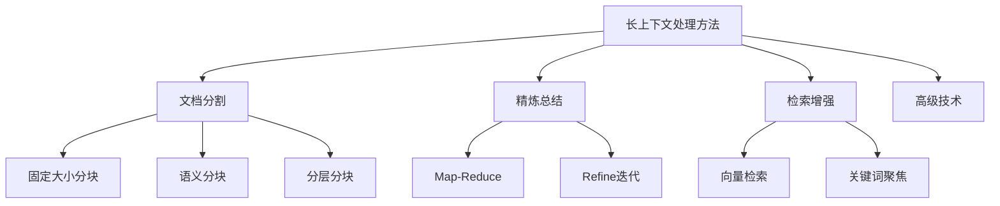

# 长上下文处理

长上下文处理的目的是为了让大模型能够有效处理超出其单次处理能力的超长文本



## 公共代码

```python
from langchain.chat_models import ChatOpenAI
from langchain.document_loaders import TextLoader

# 初始化模型
api_key = ""
api_base = ""
llm = ChatOpenAI(
    model="GLM-4.7",
    openai_api_key=api_key,
    openai_api_base=api_base,
    temperature=0
)

# 加载文档
text_path = "loader.txt"
text_loader = TextLoader(file_path=text_path, encoding="utf-8")
text_documents = text_loader.load()
text_contents = [i.page_content for i in text_documents]
```

## 文档分割
- CharacterTextSplitter: 字符分割器，适合处理结构规整、有明确分隔符的特定类型文本
- RecursiveCharacterTextSplitter: 递归字符分割器，按分隔符优先级尝试分割，能够更好的适应文章、文档等自然语言文本

### 字符串分割

```python
from langchain.text_splitter import CharacterTextSplitter, RecursiveCharacterTextSplitter

#初始化切分器
text_splitter = CharacterTextSplitter(
    separator="。",#切割的标志字符，默认是\n\n
    chunk_size=50,#切分的文本块大小，一般通过长度函数计算
    chunk_overlap=20,#切分的文本块重叠大小，一般通过长度函数计算
    length_function=len,#长度函数,也可以传递tokenize函数
    add_start_index=True,#是否添加起始索引
    is_separator_regex=False,#是否是正则表达式
)
recursive_text_splitter = RecursiveCharacterTextSplitter(
    chunk_size=50,#切分的文本块大小，一般通过长度函数计算
    chunk_overlap=20,#切分的文本块重叠大小，一般通过长度函数计算
    length_function=len,#长度函数,也可以传递tokenize函数
    add_start_index=True,#是否添加起始索引
    separators=["\n\n", "\n", "。", "！", "？", "，", " ", ""] # 优先级分隔符
)

# 切割单个字符串
result1 = text_splitter.split_text(text_contents[0])
print(result1[0])

# 批量切割字符串列表
result2 = text_splitter.create_documents(text_contents)
print(result2[0])

# 切割文档
result3 = text_splitter.split_documents(text_documents)
print(result3[0])
```

## 精炼总结

### Map-Reduce
Map并行处理每个文本块生成局部总结，Reduce 将局部总结合并为最终结果

```python
from langchain.chains.summarize import load_summarize_chain
from langchain.prompts import PromptTemplate

def create_map_reduce_chain(llm):
    """创建完整的Map-Reduce处理链"""

    # Map阶段：处理每个分块
    map_template = """请总结以下文本片段的核心内容：
    {text}
    
    核心内容总结："""
    map_prompt = PromptTemplate(template=map_template, input_variables=["text"])

    # Reduce阶段：合并所有总结
    reduce_template = """请基于以下多个总结片段，生成一个连贯、全面的总体总结：
    {text}
    
    总体总结："""
    reduce_prompt = PromptTemplate(template=reduce_template, input_variables=["text"])

    chain = load_summarize_chain(
        llm,
        chain_type="map_reduce",
        map_prompt=map_prompt,
        combine_prompt=reduce_prompt,
        verbose=True
    )
    return chain

chain = create_map_reduce_chain(llm)
result = chain.run(text_documents)
print(result)
```

### Refine

```python
from langchain.chains.summarize import load_summarize_chain
from langchain.prompts import PromptTemplate

def create_refine_chain(llm):
    """创建Refine迭代处理链"""

    # 初始问题提示
    question_template = """请总结以下内容的主要观点：
    {text}
    
    主要观点："""
    question_prompt = PromptTemplate(
        template=question_template,
        input_variables=["text"]
    )

    # 迭代优化提示
    refine_template = """现有总结：{existing_answer}
    
    新增内容：{text}
    
    请结合新内容完善总结，保持逻辑连贯性："""
    refine_prompt = PromptTemplate(
        template=refine_template,
        input_variables=["existing_answer", "text"]
    )

    chain = load_summarize_chain(
        llm,
        chain_type="refine",
        question_prompt=question_prompt,
        refine_prompt=refine_prompt,
        verbose=True
    )
    return chain

chain = create_refine_chain(llm)
result = chain.run(text_documents)
print(result)
```

## 检索增强

### 向量检索

```shell
# 对应 langchain 0.0.279
pip install chromadb==0.4.15
```

```python
from langchain.chains.summarize import load_summarize_chain
from langchain.embeddings import HuggingFaceEmbeddings
from langchain.vectorstores import Chroma

class RetrievalFocusedProcessor:
    """基于检索的长文档处理"""

    def __init__(self, llm, embedding_model="all-MiniLM-L6-v2"):
        self.llm = llm
        self.embeddings = HuggingFaceEmbeddings(model_name=embedding_model)
        self.vectorstore = None

    def create_index(self, documents):
        """创建文档向量索引"""
        self.vectorstore = Chroma.from_documents(documents, self.embeddings)

    def query_focused_process(self, query, top_k=3):
        """基于查询的聚焦处理"""
        # 检索最相关的文档块
        relevant_docs = self.vectorstore.similarity_search(query, k=top_k)

        # 仅处理相关部分
        if len(relevant_docs) == 1:
            chain = load_summarize_chain(self.llm, chain_type="stuff")
        else:
            chain = load_summarize_chain(self.llm, chain_type="map_reduce")

        return chain.run(relevant_docs)

# 使用示例
processor = RetrievalFocusedProcessor(llm)
processor.create_index(text_documents)

# 针对特定问题处理
result = processor.query_focused_process("蒂法背上的伤痕是谁造成的？")
print(result)
```


