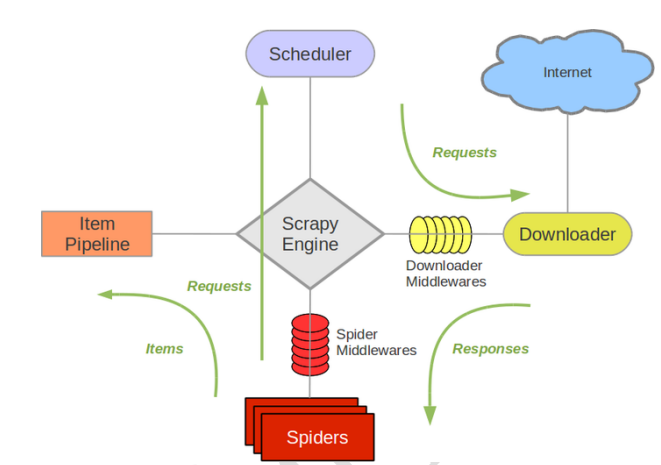

## Scrapy

### 简介


### 安装依赖

```shell
# pip install -i  https://pypi.tuna.tsinghua.edu.cn/simple virtualenv
pip install scrapy
```

### 创建项目

```shell
scrapy startproject tutorial
```

### 在spiders目录下创建spider

```python
import re
import json

import scrapy


class QuotesSpider(scrapy.Spider):
    name = "quotes"
    headers = {
        "User-Agent": "Mozilla/5.0 (Windows NT 10.0; Win64; x64) AppleWebKit/537.36 (KHTML, like Gecko) Chrome/70.0.3538.102 Safari/537.36"
    }

    def start_requests(self):
        urls = [
            'https://quotes.toscrape.com',
        ]
        for url in urls:
            yield scrapy.Request(url=url, callback=self.parse, headers=self.headers)

    def parse(self, response):
    	page_list = re.findall(r"https://quotes.toscrape.com/page/\d+", response.text)
    	for page in page_list:
            # POST 请求
            param = {}
            yield scrapy.Request(url=page, body=json.dumps(parma), callback=self.parse_detail, headers={"Content-Type": "application/json"}, method="POST")

    def parse_detail(self, response):
    	pass
```

### 定义数据实体类

```python
from scrapy.item import Item, Field

class CustomItem(Item):
    field_one = Field()
    field_two = Field()
    field_three = Field()
```

### Spider中封装数据

```python
def parse_detail(self, response):
	# 第一种情况 json数据解析
	hashmap = json.loads(response.text)
	customItem = CustomItem();
	customItem['field_one'] = hashmap.get('field_one')
	customItem['field_two'] = hashmap.get('field_two')
	customItem['field_three'] = hashmap.get('field_three')
	yield customItem

def parse_detail(self, response):
	# 第二种情况 静态页面提取
	customItem = CustomItem();
	customItem['field_one'] = response.css("#field_one").extract_first()
	customItem['field_two'] = response.css("#field_two").extract_first()
	customItem['field_three'] = response.css("#field_three").extract_first()
	yield customItem
```

### Pipeline数据入库

修改settings.py启用Pipeline

```python
ITEM_PIPELINES = {
   'datafinance.pipelines.MongoPipeline': 300,
}
```

MongoPipeline

```python
import pymongo
from itemadapter import ItemAdapter

class MongoPipeline:

    collection_name = 'scrapy_items'

    def __init__(self, mongo_uri, mongo_db):
        self.mongo_uri = mongo_uri
        self.mongo_db = mongo_db

    @classmethod
    def from_crawler(cls, crawler):
        return cls(
            mongo_uri=crawler.settings.get('MONGO_URI'),
            mongo_db=crawler.settings.get('MONGO_DATABASE')
        )

    def open_spider(self, spider):
        self.client = pymongo.MongoClient(self.mongo_uri)
        self.db = self.client[self.mongo_db]

    def close_spider(self, spider):
        self.client.close()

    def process_item(self, item, spider):
        self.db[self.collection_name].insert_one(ItemAdapter(item).asdict())
        return item
```

MysqlPipeline

```python
from itemadapter import ItemAdapter

import mysql.connector

class MysqlPipeline:

    def __init__(self, host, port, user, password, database):
        self.host = host
        self.port = port
        self.user = user
        self.password = password
        self.database = database

    @classmethod
    def from_crawler(cls, crawler):
        return cls(
            host=crawler.settings.get('MYSQL_HOST'),
            port=crawler.settings.get('MYSQL_PORT'),
            user=crawler.settings.get('MYSQL_USER'),
            password=crawler.settings.get('MYSQL_PASSWORD'),
            database=crawler.settings.get('MYSQL_DATABASE')
        )

    def open_spider(self, spider):
        self.conn = mysql.connector.connect(
                host=self.host,
                port=self.port,
                user=self.user,
                password=self.password,
                database=self.database
            )
        self.cur = self.conn.cursor()

    def close_spider(self, spider):
        self.cur.close()
        self.conn.close()

    def process_item(self, item, spider):
        self.cur.execute("")
        self.conn.commit()
```

### 交互式测试

```shell
scrapy shell "https://quotes.toscrape.com"
```

### 启动任务

```shell
scrapy crawl quotes
```

### 选择器

|目标|CSS|XPath|
|---|---|---|
|所有元素|*|//*|
|所有的P元素|p|//p|
| 所有的p元素的子元素 | p  * | //p/* |
|根据ID获取元素 |   #foo  |  //*[@id='foo'] |
|根据Class获取元素 | .foo |  //*[contains(@class,'foo')] |
|拥有某个属性的元素 | [title] | //*[@title] |
|div下的第一个p元素 | div p:nth-child(1) |  //div/p[0] |
| 所有拥有子元素a的P元素 |无法实现 |  //p[a] |
|下一个兄弟元素 | p + * |   //p/following-sibling::*[0] |