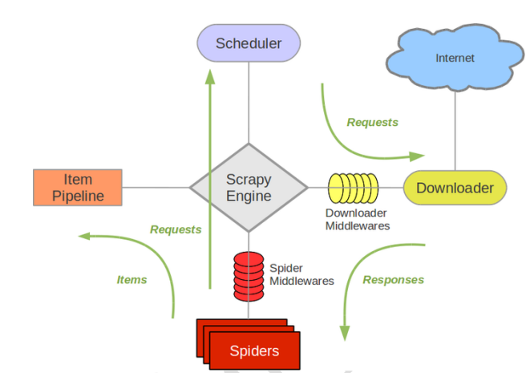

# Scrapy基础

Scrapy 是一个用 Python 编写的开源网络爬虫框架，用于快速、高效地抓取网站数据。它提供了完整的爬虫开发解决方案。



## 环境安装

```shell
# 安装 Scrapy
pip install scrapy -i https://mirrors.aliyun.com/pypi/simple

# 验证安装
scrapy version
```

## 项目创建

1. 创建项目
    ```shell
    scrapy startproject myproject
    cd myproject
    ```
2. 项目结构
    ```
    myproject/
    ├── scrapy.cfg
    └── myproject/
        ├── __init__.py
        ├── items.py
        ├── middlewares.py
        ├── pipelines.py
        ├── settings.py
        └── spiders/
            └── __init__.py
    ```
3. 创建 Spider
   ```python
   import scrapy
   from myproject.items import ProductItem
   
   class MySpider(scrapy.Spider):
       name = "myspider"
   
       # 起始URL列表
       start_urls = [
           'http://example.com/page1',
           'http://example.com/page2'
       ]
   
       # 或使用 start_requests 方法
       def start_requests(self):
           for url in self.start_urls:
               yield scrapy.Request(url=url, callback=self.parse)
   
       def parse(self, response):
           # CSS 选择器示例
           title = response.css('title::text').get()
   
           # XPath 选择器示例
           description = response.xpath('//meta[@name="description"]/@content').get()
   
           # 提取链接并跟进
           for link in response.css('a::attr(href)').getall():
               yield response.follow(link, callback=self.parse_page)
   
           # 返回 Item
           item = ProductItem()
           item['title'] = title
           item['description'] = description
           yield item
   
       def parse_page(self, response):
           # 处理具体页面
           pass
   ```
4. 定义数据模型 Item
   ```python
   import scrapy
   
   class ProductItem(scrapy.Item):
       name = scrapy.Field()
       price = scrapy.Field()
       description = scrapy.Field()
       image_urls = scrapy.Field()
       images = scrapy.Field()
   ```
5. 自定义数据处理管道 Pipeline
   ```python
   class MySQLPipeline:
       def __init__(self, mysql_config):
           self.mysql_config = mysql_config
           self.connection = None
           self.cursor = None
           self.logger = logging.getLogger(__name__)
   
       @classmethod
       def from_crawler(cls, crawler):
           """从 Crawler 实例化 Pipeline（推荐）"""
           return cls(
               mysql_config={
                   'host': crawler.settings.get('MYSQL_HOST', 'localhost'),
                   'port': crawler.settings.get('MYSQL_PORT', 3306),
                   'user': crawler.settings.get('MYSQL_USER', 'root'),
                   'password': crawler.settings.get('MYSQL_PASSWORD', 'password'),
                   'database': crawler.settings.get('MYSQL_DATABASE', 'dbname'),
                   'charset': crawler.settings.get('MYSQL_CHARSET', 'utf8mb4'),
               }
           )
   
       def open_spider(self, spider):
           """爬虫启动时连接数据库"""
           try:
               self.connection = pymysql.connect(**self.mysql_config)
               self.cursor = self.connection.cursor()
               self.logger.info("成功连接到MySQL数据库")
   
               # 创建表（如果不存在）
               self.create_table(spider)
   
           except pymysql.Error as e:
               self.logger.error(f"连接MySQL失败: {e}")
               raise
   
       def close_spider(self, spider):
           """爬虫关闭时关闭数据库连接"""
           if self.connection:
               self.connection.close()
               self.logger.info("MySQL连接已关闭")
   
       def process_item(self, item, spider):
           """处理每个item，插入或更新数据库"""
           self.save(item)
           return item
   
       def create_table(self, spider):
           """创建数据表"""
           pass
   
       def save(self, item):
           """新增或更新数据"""
           pass
   ```
6. 自定义中间件 Middleware
   ```python
   class RandomUserAgentMiddleware:
       def __init__(self, user_agents):
           self.user_agents = user_agents
   
       @classmethod
       def from_crawler(cls, crawler):
           """从 Crawler 实例化 Middleware"""
           return cls(crawler.settings.getlist('USER_AGENTS'))
   
       def process_request(self, request, spider):
           request.headers['User-Agent'] = random.choice(self.user_agents)
   
   class ProxyMiddleware:
       def process_request(self, request, spider):
           request.meta['proxy'] = "http://proxy-server:port"
   ```

## 配置管理

```python
# settings.py
BOT_NAME = 'myproject'

# 并发设置
CONCURRENT_REQUESTS = 16
CONCURRENT_REQUESTS_PER_DOMAIN = 8

# 下载延迟
DOWNLOAD_DELAY = 1

# User-Agent
USER_AGENTS = 'Mozilla/5.0 (Windows NT 10.0; Win64; x64) AppleWebKit/537.36 (KHTML, like Gecko) Chrome/142.0.0.0 Safari/537.36'

# 管道配置
ITEM_PIPELINES = {
    'myproject.pipelines.MySQLPipeline': 100,
}

# 中间件
DOWNLOADER_MIDDLEWARES = {
    'myproject.middlewares.RandomUserAgentMiddleware': 400,
    'myproject.middlewares.ProxyMiddleware': 100,
}

# 遵守 robots.txt
ROBOTSTXT_OBEY = True

# Cookies 启用
COOKIES_ENABLED = False
```

## 数据提取

| 目标           | CSS                | XPath                       |
|--------------|--------------------|-----------------------------|
| 所有元素         | *                  | //*                         |
| 所有的P元素       | p                  | //p                         |
| 所有的p元素的子元素   | p  *               | //p/*                       |
| 根据ID获取元素     | #foo               | //*[@id='foo']              |
| 根据Class获取元素  | .foo               | //*[contains(@class,'foo')] |
| 拥有某个属性的元素    | [title]            | //*[@title]                 |
| div下的第一个p元素  | div p:nth-child(1) | //div/p[0]                  |
| 所有拥有子元素a的P元素 | 无法实现               | //p[a]                      |
| 下一个兄弟元素      | p + *              | //p/following-sibling::*[0] |


## 调式和启动
Shell调试
```shell
scrapy shell "http://example.com"

# 在 shell 中测试选择器
>>> response.css('title::text').get()
>>> view(response)  # 在浏览器中查看
```

启动Spider
```shell
scrapy crawl myspider
```