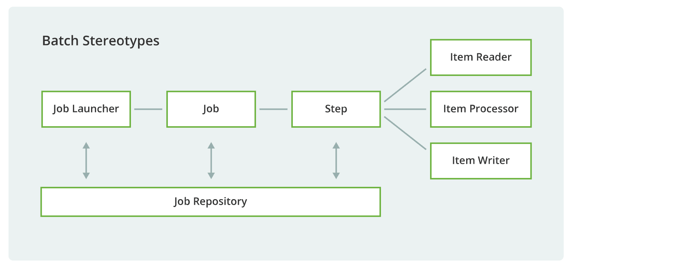

# Spring Batch

## 背景

在日常企业项目开发过程中，我们往往会遇到 数据处理、数据定时统计等批处理需求，如果清晰的实现代码逻辑，以及任务过程中的异常处理方式成了我们首当其冲需要解决的问题。


## Spring Batch 是什么
简单来说，SpringBatch把批处理简化为Job和Step两部分，在Step中，把数据处理分为读数据(Reader)、处理数据(Processor)、写数据（Writer）三个步骤，
异常处理机制分为跳过、重试、重启三种，作业方式分为多线程、并行、远程、分区四种。开发者在开发过程中，大部分工作是根据业务要求编写Reader、Processor和Writer即可，
提高了批处理开发的效率。同时SpringBatch本身也提供了很多默认的Reader和Writer，开箱即用.

## 框架



1. JobRepository job的注册/存储器
2. JobLauncher job的执行器
3. Job job任务，包含一个或多个Step
4. Step 包含（ItemReader、ItemProcessor和ItemWriter)
5. ItemReader 数据读取器
6. ItemProcessor 数据处理器
7. ItemWriter 数据输出器

Spring Batch里最基本的单元就是任务Job，一个Job由若干个步骤Step组成。任务启动器Job Launcher负责运行Job，
任务存储仓库Job Repository存储着Job的执行状态，参数和日志等信息。
Job处理任务又可以分为三大类：数据读取Item Reader、数据中间处理Item Processor和数据输出Item Writer。

## Spring Boot 集成

### 引入依赖
```xml
<dependencies>
    <dependency>
        <groupId>org.springframework.boot</groupId>
        <artifactId>spring-boot-starter-batch</artifactId>
    </dependency>

    <dependency>
        <groupId>mysql</groupId>
        <artifactId>mysql-connector-java</artifactId>
        <version>${mysql.version}</version>
    </dependency>

    <dependency>
        <groupId>org.mybatis.spring.boot</groupId>
        <artifactId>mybatis-spring-boot-starter</artifactId>
        <version>${mybatis.version}</version>
    </dependency>
</dependencies>
```

### 配置数据库连接

```yaml
spring:
  datasource:
    url: jdbc:mysql://localhost:3306/blog
    username: root
    password: root
    driver-class-name: com.mysql.jdbc.Driver
  batch:
    jdbc:
      # 自动生成Spring Batch框架表
      # 手动创建: 数据库中执行org.springframework.batch.core目录下的对应schema-mysql.sql
      initialize-schema: always
    job:
      # 自己控制任务的执行，设置成false
      enabled: false
```

### 开启批处理
新增 `@EnableBatchProcessing` 开启批处理

```java
@EnableBatchProcessing
@SpringBootApplication
public class SpringBootBatchApplication {

	public static void main(String[] args) {
		SpringApplication.run(SpringBootBatchApplication.class, args);
	}
}
```

### 任务示例

#### 单步骤任务
```java
@Component
public class SingleStepJobConfig {
    @Resource
    private JobBuilderFactory jobBuilderFactory;
    @Resource
    private StepBuilderFactory stepBuilderFactory;

    @Bean
    public Job singleStepJob() {
        return jobBuilderFactory.get("singleStepJob")
                .start(step())
                .build();
    }

    private Step step() {
        return stepBuilderFactory.get("step")
                .tasklet((contribution, chunkContext) -> {
                    System.out.println("执行步骤....");
                    return RepeatStatus.FINISHED;
                }).build();
    }
}
```

#### 多步骤任务
```java
@Component
public class MultiStepJobConfig {
    @Resource
    private JobBuilderFactory jobBuilderFactory;
    @Resource
    private StepBuilderFactory stepBuilderFactory;

    @Bean
    public Job multiStepJob() {
        return jobBuilderFactory.get("multiStepJob")
                .start(step1())
                .next(step2())
                .next(step3())
                .build();
    }

    private Step step1() {
        return stepBuilderFactory.get("step1")
                .tasklet((stepContribution, chunkContext) -> {
                    System.out.println("执行步骤一操作。。。");
                    return RepeatStatus.FINISHED;
                }).build();
    }

    private Step step2() {
        return stepBuilderFactory.get("step2")
                .tasklet((stepContribution, chunkContext) -> {
                    System.out.println("执行步骤二操作。。。");
                    return RepeatStatus.FINISHED;
                }).build();
    }

    private Step step3() {
        return stepBuilderFactory.get("step3")
                .tasklet((stepContribution, chunkContext) -> {
                    System.out.println("执行步骤三操作。。。");
                    return RepeatStatus.FINISHED;
                }).build();
    }
}
```

#### Flow任务
```java
@Component
public class FlowStepJobConfig {
    @Resource
    private JobBuilderFactory jobBuilderFactory;
    @Resource
    private StepBuilderFactory stepBuilderFactory;

    @Bean
    public Job flowJob() {
        return jobBuilderFactory.get("flowJob")
                .start(flow())
                .next(step3())
                .end()
                .build();
    }

    private Step step1() {
        return stepBuilderFactory.get("step1")
                .tasklet((stepContribution, chunkContext) -> {
                    System.out.println("执行步骤一操作。。。");
                    return RepeatStatus.FINISHED;
                }).build();
    }

    private Step step2() {
        return stepBuilderFactory.get("step2")
                .tasklet((stepContribution, chunkContext) -> {
                    System.out.println("执行步骤二操作。。。");
                    return RepeatStatus.FINISHED;
                }).build();
    }

    private Step step3() {
        return stepBuilderFactory.get("step3")
                .tasklet((stepContribution, chunkContext) -> {
                    System.out.println("执行步骤三操作。。。");
                    return RepeatStatus.FINISHED;
                }).build();
    }

    /**
     * 创建一个flow对象，包含若干个step
     */
    private Flow flow() {
        return new FlowBuilder<Flow>("flow")
                .start(step1())
                .next(step2())
                .build();
    }
}
```

### 最佳实践

#### 实体类定义

```java
@Data
@Builder
@NoArgsConstructor
@AllArgsConstructor
public class ArticleDTO {
    private Integer id;

    private String title;

    private String summary;

    private Integer userId;

    private Integer viewCount;

    private Integer commentCount;

    private Integer status;

    private Date createTime;

    private Date updateTime;

    private String content;
}
```

```java
@Data
@Builder
@NoArgsConstructor
@AllArgsConstructor
public class ArticleVO {
    private Integer id;

    private String title;

    private String summary;

    private Integer userId;

    private Integer viewCount;

    private Integer commentCount;

    private Integer status;

    private Date createTime;

    private Date updateTime;

    private String content;
}
```

#### 任务编排
```java
@Component
public class DataSourceArticleJobConfig {

    @Resource
    private JobBuilderFactory jobBuilderFactory;
    @Resource
    private StepBuilderFactory stepBuilderFactory;
    @Resource
    private DataSource dataSource;
    @Resource
    private ArticleTransformItemProcessor articleTransformItemProcessor;
    @Resource
    private LogJobExecutionListener logJobExecutionListener;

    /**
     * 定义Job
     */
    @Bean
    public Job dataSourceArticleJob() throws Exception {
        return jobBuilderFactory.get("dataSourceArticleJob")
                .start(dataSourceArticleStep())
                // 配置Job监听器
                .listener(logJobExecutionListener)
                .build();
    }

    /**
     * 定义Step
     */
    private Step dataSourceArticleStep() throws Exception {
        return stepBuilderFactory.get("dataSourceArticleStep")
                // chunkSize 是最后调用写入的时候，一次性写入多少条已处理的数据
                .<ArticleDTO, ArticleVO>chunk(2)
                .reader(dataSourceArticleReader())
                .processor(articleTransformItemProcessor)
                .writer(dataSourceArticleWriter())

                // 异常处理
//                .faultTolerant() // 配置错误容忍
//                .retry(Exception.class) // 配置重试的异常类型
//                .retryLimit(3) // 重试3次，三次过后还是异常的话，则任务会结束

//                .faultTolerant() // 配置错误容忍
//                .skip(Exception.class) // 配置跳过的异常类型
//                .skipLimit(1) // 最多跳过1次，1次过后还是异常的话，则任务会结束
                .build();
    }

    /**
     * 数据库Reader
     */
    private ItemReader<ArticleDTO> dataSourceArticleReader() throws Exception {
        JdbcPagingItemReader<ArticleDTO> reader = new JdbcPagingItemReader<>();
        reader.setDataSource(dataSource); // 设置数据源
        reader.setFetchSize(10); // 每次取多少条记录
        reader.setPageSize(10); // 设置每页数据量

        // 指定sql查询语句 select id,title,summary,userId,viewCount,commentCount,status,createTime,updateTime,content from blog_article
        MySqlPagingQueryProvider provider = new MySqlPagingQueryProvider();
        //设置查询字段
        provider.setSelectClause("id,title,summary,user_id,view_count,comment_count,status,content");
        // 设置从哪张表查询
        provider.setFromClause("from blog_article");

        // 将读取到的数据转换为ArticleDTO对象
        reader.setRowMapper((resultSet, rowNum) -> ArticleDTO.builder()
                .id(resultSet.getInt(1))
                .title(resultSet.getString(2))
                .summary(resultSet.getString(3))
                .userId(resultSet.getInt(4))
                .viewCount(resultSet.getInt(5))
                .commentCount(resultSet.getInt(6))
                .status(resultSet.getInt(7))
                .content(resultSet.getString(8))
                .build());

        Map<String, Order> sort = new HashMap<>(1);
        sort.put("id", Order.ASCENDING);
        // 设置排序,通过id 升序
        provider.setSortKeys(sort);
        reader.setQueryProvider(provider);
        // 设置namedParameterJdbcTemplate等属性
        reader.afterPropertiesSet();
        return reader;
    }

    /**
     * 数据库Writer
     */
    private ItemWriter<ArticleVO> dataSourceArticleWriter() {
        // ItemWriter的实现类之一，mysql数据库数据写入使用JdbcBatchItemWriter
        // 其他实现：MongoItemWriter,Neo4jItemWriter等
        JdbcBatchItemWriter<ArticleVO> writer = new JdbcBatchItemWriter<>();
        // 设置数据源
        writer.setDataSource(dataSource);

        String sql = "insert into blog_article_copy(id,title,summary,user_id,view_count,comment_count,status,content) " +
                "values (:id,:title,:summary,:userId,:viewCount,:commentCount,:status,:content)";
        // 设置插入sql脚本
        writer.setSql(sql);

        // 映射ArticleDTO对象属性到占位符中的属性
        BeanPropertyItemSqlParameterSourceProvider<ArticleVO> provider = new BeanPropertyItemSqlParameterSourceProvider<>();
        writer.setItemSqlParameterSourceProvider(provider);
        // 设置一些额外属性
        writer.afterPropertiesSet();
        return writer;
    }
}
```

#### 自定义处理器

```java
@Component
public class ArticleTransformItemProcessor implements ItemProcessor<ArticleDTO, ArticleVO> {
    @Override
    public ArticleVO process(ArticleDTO articleDTO) throws Exception {
        // 过滤
        Integer DELETE = 0;
        if (DELETE.equals(articleDTO.getStatus())) {
            return null;
        }
        // 数据转换
        ArticleVO articleVO = new ArticleVO();
        BeanUtils.copyProperties(articleDTO, articleVO);
        return articleVO;
    }
}
```

#### Job监听器
在Job开始之前(beforeJob)和之后(afterJob)触发
```java
@Slf4j
@Component
public class LogJobExecutionListener implements JobExecutionListener {

    @Override
    public void beforeJob(JobExecution jobExecution) {
        log.info("before job execute: {}", jobExecution.getJobInstance().getJobName());
    }

    @Override
    public void afterJob(JobExecution jobExecution) {
        log.info("after job execute: {}", jobExecution.getJobInstance().getJobName());
    }
}
```

#### 任务接口调用

```java
@RestController
@RequestMapping("job")
public class JobController {

    @Resource
    private Job dataSourceArticleJob;

    @Resource
    private JobLauncher jobLauncher;

    @GetMapping("launcher")
    public String launcher(@RequestParam("timestamp") String timestamp) throws Exception {
        JobParameters parameters = new JobParametersBuilder()
                .addString("timestamp", timestamp)
                .toJobParameters();
        // 将参数传递给任务
        jobLauncher.run(dataSourceArticleJob, parameters);
        return "success";
    }
}
```