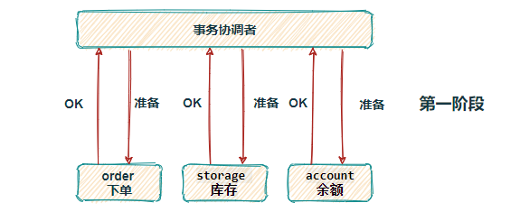
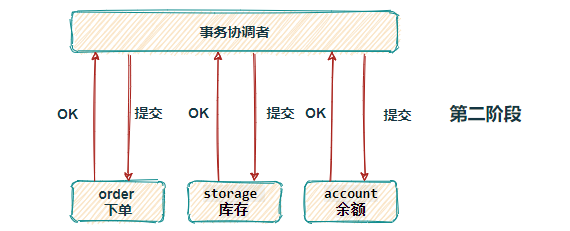
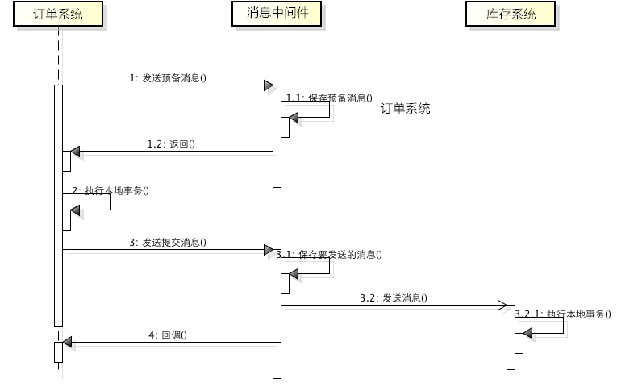

# Spring Boot 分布式事务

生产环境首选基于消息队列最终一致性

## XA二阶段提交

XA是一种常用的分布式事务协议，由事务管理器和本地资源管理器两部分组成。
本地资源管理器通常是由数据库实现的，而事务管理器则是全局的调度者，负责协调各个本地资源的提交和回滚

### 执行步骤

1. 第一阶段是表决阶段，所有参与者都将本事务能否成功的信息反馈发给协调者；

2. 第二阶段是执行阶段，协调者根据所有参与者的反馈，通知所有参与者，步调一致地在所有分支上提交或者回滚。

### 存在的问题
1. 事务执⾏过程中需要将所需资源全部锁定，因此性能较差
2. 事务协调者是单点一旦发生故障,参与者将⽆法释放事务资源，也⽆法完成事务操作
3. 数据不⼀致。当执⾏事务提交过程中，如果协调者向所有参与者发送 `commit` 请求后，发⽣局部⽹络异常或者协调者在尚未发送完 `commit` 请求，即出现崩溃，
最终导致只有部分参与者收到、执⾏请求

## TCC 事务补偿

Try-Confirm-Cancel

## 消息队列最终一致性

### 执行步骤

1. 订单系统向 `MQ` 发送一条预备扣减库存消息，`MQ` 保存预备消息并返回成功 `ACK`
2. 接收到预备消息执行成功 `ACK`，订单系统执行本地下单操作，为防止消息发送成功而本地事务失败，订单系统会实现 MQ 的回调接口，其内不断的检查本地事务是否执行成功，如果失败则 `rollback` 回滚预备消息；成功则对消息进行最终 `commit` 提交。
3. 库存系统消费扣减库存消息，执行本地事务，如果扣减失败，消息会重新投，一旦超出重试次数，则本地表持久化失败消息，并启动定时任务做补偿。