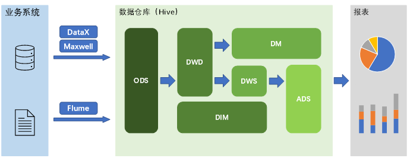
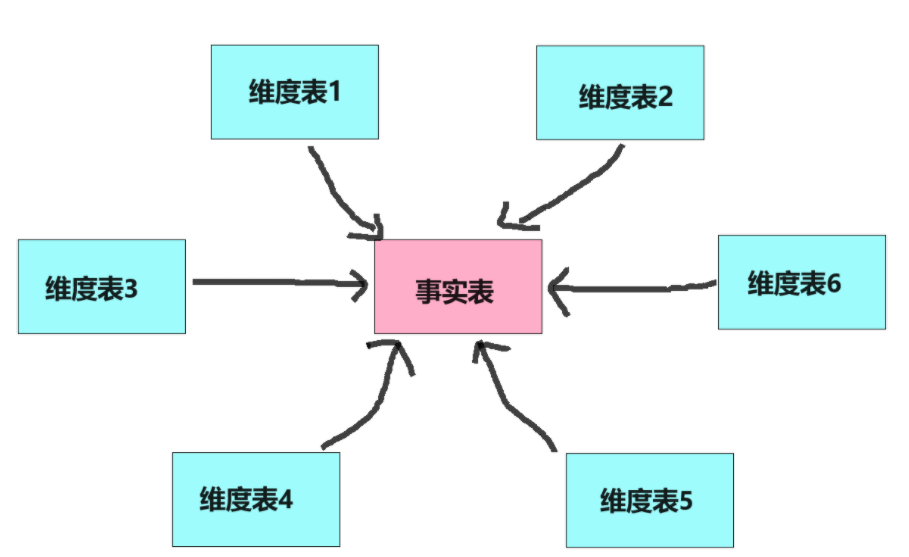
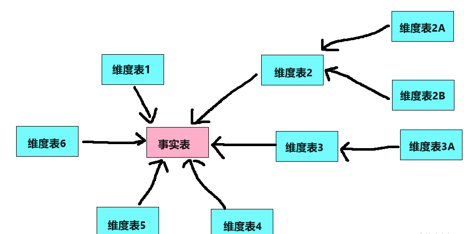

# 数据仓库

## 概念
数据仓库是一个专门设计用于支持企业业务、分析报告和决策支持系统的重要组成部分。
它是一个中心化的数据库，用于收集和管理来自不同源系统的数据。
数据仓库的主要目标是提供一个集成的、历史的、以及面向主题的数据视图，以支持决策制定过程。

## 组成部分

- **数据源**
- **ETL 过程**：提取（Extract）、转换（Transform）、加载（Load）的过程，用于从源系统中获取数据、转换成统一格式并加载到数据仓库中
- **数据模型**：定义如何在数据仓库中组织和存储数据的逻辑结构
- **数据存储**：存储转换后数据的中心化数据库
- **前端工具**：用于访问数据仓库的工具，包括报表工具、在线分析处理 (OLAP) 工具、商业智能 (BI) 软件等

### 技术选型

- 数据采集: Flume、Kafka、DataX、Maxwell、Sqoop
- 数据存储: HDFS、Hbase、MySQL、Redis、Mongodb、Elasticsearch
- 数据计算: Hive、Spark、Flink、Storm、Tez
- 数据查询: Presto、Kylin、Impala、Druid、ClickHouse、Doris
- 数据可视化: Superset
- 任务调度: DolphinScheduler、Azkaban、Airflow
- 集群监控: Zabbix、Prometheus
- 元数据管理: Atlas
- 权限管理: Ranger

| 框架               | 版本     |
|------------------|--------|
| Hadoop           | 3.3.4  |
| Hive             | 3.1.3  |
| Hbase            | 2.4.11 |
| Zookeeper        | 3.7.1  |
| Kafka            | 3.3.1  |
| Flume            | 1.10.1 |
| Spark            | 3.3.1  |
| MySQL            | 8.0.31 |
| DolphinScheduler | 2.0.5  |
| Superset         | 2.0.0  |

## 数据源

### 用户行为数据

用户在使用产品过程中，通过埋点收集与客户端产品交互过程中产生的数据，通常存储在日志文件中。  
例如页面浏览、点击、停留、评论、点赞、收藏等，用户行为数据。

### 业务数据
各行业在处理事务过程中产生的数据。  
例如商品、订单数据、支付数据等。

## 数据模型

### ER模型
实体关系（Entity Relationship，ER）模型将复杂的数据抽象为两个概念——实体和关系，遵循三范式。  
这种建模方法的出发点是整合数据，其目的是将整个企业的数据进行组合和合并，并进行规范处理，减少数据冗余性，保证数据的一致性。
但不适合直接用于分析统计，常用于 `OLTP` 数据库建模。

### 维度模型
维度模型将复杂的业务通过事实和维度两个概念进行呈现。事实通常对应业务过程，而维度通常对应业务过程发生时所处的环境。

#### 事实表 (Fact Table)
事实表作为数据仓库维度建模的核心，紧紧围绕着业务过程来设计。

- **特点**:
    - 包含大量行，因为每一项业务事件都会产生一条记录
    - 每个记录都代表了一个具体的业务事件
    - 包含与维度表连接的外键

- **示例**:
    - 订单事实表包含如下字段：订单ID、总金额、订单状态、用户ID、创建时间

#### 维度表 (Dimension Table)
维度表提供了描述事实表中数据的详细信息。它们通常包含描述性的文本信息，帮助用户理解数据的含义。

- **特点**:
    - 相对于事实表来说行数较少
    - 包含描述性字段，比如文本、代码或标志
    - 可能包含层次结构，比如时间维度表中的“年”、“季度”、“月”、“日”

- **示例**:
    - 时间维度表可能包含如下字段：日期、星期几、月份、季度、年份等。
    - 地理位置维度表可能包含：国家、省份/州、城市、邮政编码等。
    - 客户维度表可能包含：客户ID、姓名、地址、性别、年龄等。

- **维度设计**:
    - 星型模型
      
    - 雪花模型  
      
  数据仓库系统的主要目的是用于数据分析和统计，所以是否方便用户进行统计分析决定了模型的优劣。
  采用雪花模型，用户在统计分析的过程中需要大量的关联操作，使用复杂度高，同时查询性能很差，而采用星型模型，
  则方便、易用且性能好。所以出于易用性和性能的考虑，维度表一般是很不规范化的。

## 数据仓库设计

### ODS (Operation Data Store)
原始数据层，存放未经处理的原始数据，数据结构与源系统保持一致，是数据仓库的数据准备区。

#### 示例
- 省份表 ods_base_province
- 品牌表 ods_base_trademark
- 商品表 ods_sku_info
- 订单表 ods_order_info
- 支付表 ods_payment_info
- 用户表 ods_user_info

### DWD (Data Warehouse Detail)
数据明细层，基于维度建模理论构建，存放维度建模中的事实表，保存业务过程最小粒度的操作记录。

#### 示例
- 下单事实表 dwd_trade_order_detail
- 支付事实表 dwd_trade_pay_detail

### DIM (Dimension)
公共维度层，基于维度建模理论构建，存放维度模型中的维度表，保存一致性维度信息。

#### 示例
- 地区维度表 dim_province
- 商品维度表 dim_sku
- 用户维度表 dim_user

### DWS (Data Warehouse Summary)
数据汇总层，基于上层指标需求，以分析的主题对象作为建模驱动，建立公共统计粒度的汇总表

#### 示例
- 用户商品订单一日汇总表 dws_trade_user_sku_order_1d
- 用户订单一日汇总表 dws_trade_user_order_1d
- 用户支付一日汇总表 dws_trade_user_payment_1d
- 用户商品订单n日汇总表 dws_trade_user_sku_order_nd

### ADS (Application Data Service)
数据应用层，存放各项统计指标结果

#### 示例
- 各品牌商品下单统计 ads_order_stats_by_tm
- 各省份交易统计 ads_order_by_province
