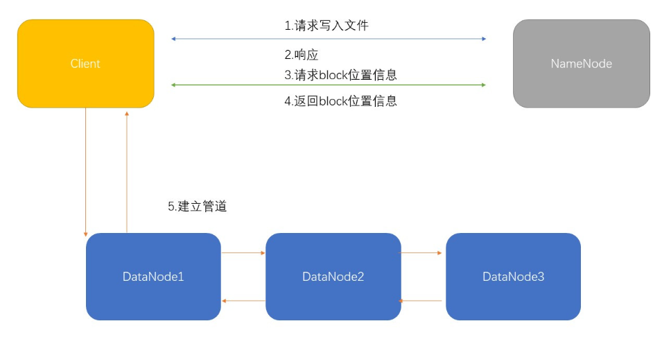
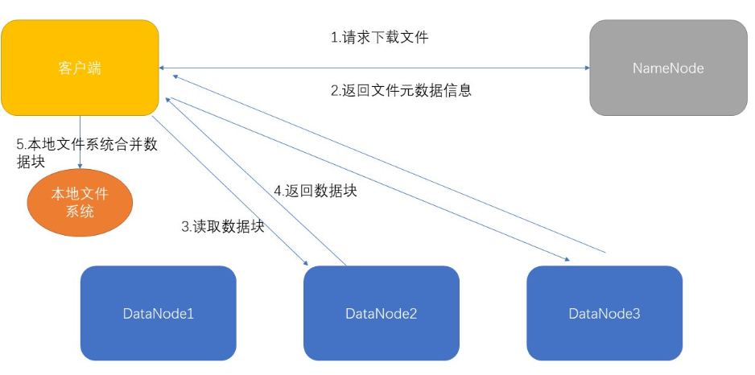

# Hadoop
Hadoop是一个由Apache基金会所开发的用于解决海量数据的存储及分析计算问题的分布式系统基础架构。

- 广义上的Hadoop是指Hadoop的整个技术生态圈
- 狭义上的Hadoop指的是其核心三大组件，包括HDFS、YARN及MapReduce

## HDFS架构
HDFS（Hadoop Distributed File System）是一个分布式文件系统，用于存储文件，通过目录树来定位文件。

### Client 客户端
1. 文件上传时将文件切分成块
2. 与NameNode交互，获取文件的位置信息
3. 与DataNode交互，读取或者写入数据

### NameNode(NN)
1. 存储文件元数据，例如文件名、目录结构、文件属性（生成时间、副本数、文件权限），以及每个文件的数据块列表和数据块映射信息等
2. 配置副本策略
3. 处理客户端读写请求

### DataNode(DN)
1. 在本地文件系统存储文件块数据，以及块数据的校验和
2. 执行数据块的读写操作

### Secondary NameNode(2NN)
1. 定期备份NameNode元数据
2. 在紧急情况下，可辅助恢复NameNode

### HDFS写入流程
1. 客户端连接服务器，客户端向NameNode发起连接并请求上传文件
2. NameNode校验文件是否存在，返回是否可以上传
3. 客户端将文件切分成固定大小的块(默认128M)，然后请求NameNode获取可以存储数据块的DataNode列表
4. NameNode返回DataNode列表(DN1,DN2,DN3)
5. 客户端上传第一个数据块至DN1，同时，DN1将接收到的数据发送至DN2，DN2将接收到的数据发送至DN3
6. 当一个数据块完成写入后，客户端开始写入下一个数据块，重复复制和写入过程

注意点:  
只要成功写入的节点数量达到dfs.replication.min(默认为1)，就认为写入成功。
NameNode会通过异步的方式将block复制到其他节点，使数据副本达到dfs.replication参数配置的个数。

### HDFS读流程

1. 客户端与NameNode进行通信查询元数据信息，即Block所在的DataNode节点
2. 根据就近原则挑选DataNode（没有就近的节点就随机选择），并建立socket流
3. DataNode开始发送数据（以packet为单位进行校验）
4. 客户端以packet为单位接受，先在本地进行缓存，然后写入目标文件中，进行合并

