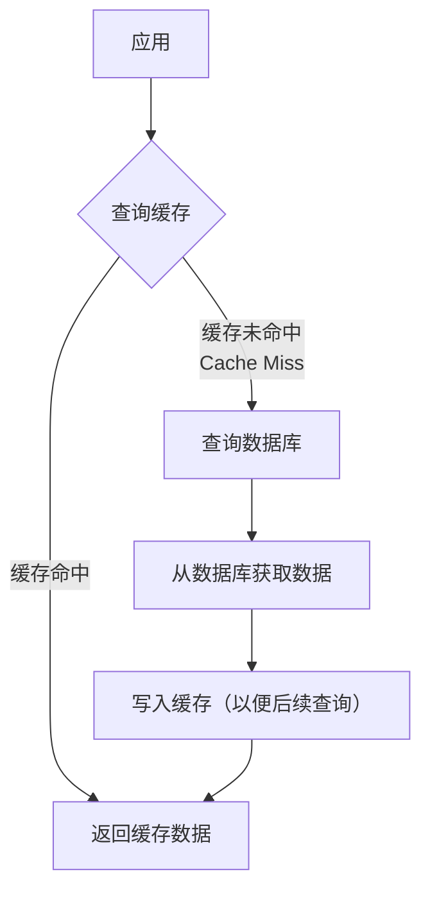

# 分布式缓存

分布式缓存是将数据分散存储在多台服务器内存中的缓存系统，通过集群方式提供高可用、高并发的数据访问服务。常见于缓解数据库压力、提升应用性能。

特点:

1. 高性能：数据存储在内存中，读写速度快（微秒级）。
2. 可扩展性：支持水平扩展，通过增加节点提升容量和吞吐量。
3. 高可用：采用主从复制、哨兵模式或集群化保证服务连续性。
4. 数据一致性：通过一致性哈希、副本同步等机制减少数据冲突。

## 常见技术方案

| 方案        | 	特点                                         |
|-----------|---------------------------------------------|
| Redis集群   | 	支持数据分片、主从故障转移，提供多种数据结构（如String/Hash/Set等）。 |
| Memcached | 	简单高效，仅支持Key-Value，适合缓存静态数据。                |

## 关键技术点

1. 数据分片
   - 哈希槽：将数据均匀分布到不同节点
   - 算法：一致性哈希、虚拟节点分片

2. 缓存更新策略
   - 缓存旁路模式
   - 写穿透：同时更新缓存和数据库
   - 写回：先更新缓存，异步刷入数据库
   - 过期淘汰：LRU/LFU/TTL自动清理旧数据

3. 一致性协议
   - Paxos/Raft：用于节点选举与状态同步（如Redis Sentinel）。

## 数据分片
数据分片的根本目的是将整个数据集按照特定规则分散到多个独立的节点上，从而突破单机容量的限制，并利用多台机器的资源实现负载均衡。

分片策略:  
1. 客户端分片  
   - 原理：分片逻辑在客户端实现。客户端代码内置特定的算法（如一致性哈希），直接计算出数据对应的节点，然后与之通信。这是Memcached采用的方式
   - 优点：架构简单，无需代理层，性能高。
   - 缺点：  
     - 客户端需要感知集群拓扑，节点变更时需要更新。
     - 不同语言的客户端需要各自实现，维护成本高。
     - 动态扩容（增删节点）时，数据迁移需要客户端配合或由外部工具触发。
2. 代理分片
   - 原理：在客户端和服务器端之间增加一个代理层（如 Twemproxy, Codis）。客户端将所有请求发送给代理，由代理根据分片规则转发到正确的后端节点
   - 优点：  
     - 对客户端透明，客户端像使用单点Redis一样简单。
     - 易于实现监控、负载均衡、协议转换等功能。
   - 缺点：  
     - 代理层可能成为性能瓶颈和单点故障（需要做代理层的高可用）。
     - 增加了一次网络跳转，带来轻微延迟。
3. 查询路由（服务端分片）
   - 原理：分片逻辑由服务器集群自身管理。集群中的每个节点都知道整个集群的“槽位映射关系”。这是 Redis Cluster 采用的方式
   - 工作流程：  
     1. 客户端随机连接一个集群节点。
     2. 如果该键属于当前节点负责的槽，则直接处理。
     3. 如果不属于，节点会向客户端返回一个 MOVED 重定向错误，并告知正确的节点地址。
     4. 客户端更新本地缓存的路由信息，然后向正确节点重新发起请求。
   - 优点：去中心化，无需代理，扩展性更好。
   - 缺点：客户端需要能处理 MOVED 和 ASK 重定向，增加了客户端的复杂性。

## 缓存更新策略

缓存更新的核心问题是：当数据源（如数据库）的数据发生变化时，如何更新或失效缓存中的数据。

### 缓存旁路模式
这是最常用、最经典的策略。其核心思想是：缓存不作为数据的唯一来源，应用代码主动管理缓存和数据库的读写。

#### 读流程

#### 写流程
写流程衍生出两种主要策略，推荐写时失效

#### 写时失效

- 操作顺序：
  1. 先更新数据库
  2. 然后立即删除缓存中的对应数据
- 核心逻辑：下次读取请求时，自然会因为缓存未命中而从数据库拉取最新数据并重新填充缓存
- 优点：
  - 简单有效：避免了复杂的双写逻辑
  - 减少数据不一致窗口：写操作只涉及数据库和一步删除操作，比双写更快。即使删除缓存失败，也只会导致一段时间内的旧数据，风险相对较小
- 缺点：
  - 缓存击穿：在删除缓存后、新数据填入前，如果发生高并发读请求，所有请求都会穿透到数据库
  - 短暂不一致：在删除缓存到新数据被加载的极短时间内，后续请求可能读到旧数据（如果并发写导致更新顺序错乱，也可能产生长时间不一致，但概率较低）

#### 写时更新

- 操作顺序：
  1. 先更新数据库。
  2. 然后立即更新缓存为最新值。
- 优点：
  - 缓存命中率高：数据总是最新的，读性能好。
- 缺点：
  - 数据不一致风险高：
    - 如果先更新缓存后更新数据库，缓存更新成功但数据库更新失败，会导致永久性数据不一致。
    - 即使顺序正确（先DB后缓存），在两个步骤之间，缓存仍是旧数据。更致命的是，并发写可能导致缓存和数据库的数据顺序错乱。
  - 缓存污染：可能将一些不常访问的“冷数据”写入缓存，浪费内存。

### 写穿透

- 原理：应用将缓存视为主要数据存储。写请求和读请求都直接操作缓存，缓存层自己负责将数据同步到数据库
- 操作顺序：应用 -> 写入缓存 -> 缓存系统同步写入数据库
- 优点：
  - 对应用透明：应用代码无需关心数据库操作，简化了逻辑
  - 保证缓存一致性：因为所有写都经过缓存，缓存总是最新的
- 缺点：
  - 缓存组件复杂：缓存系统需要集成数据库写入逻辑，增加了缓存本身的复杂度和延迟
  - 单点风险：缓存成为唯一的入口，其故障影响更大

### 写回

- 原理：也称为“写旁路”。应用只写入缓存，然后就立即返回成功。缓存系统会异步地、批量地将脏数据刷回数据库。
- 操作顺序：应用 -> 写入缓存（标记为脏）-> 立即返回 ... 缓存异步批量刷入数据库。
- 优点：
  - 极高的写性能：写操作非常快，延迟极低。
  - 数据库负载低：异步合并写操作，大大减轻数据库压力。
- 缺点：
  - 有数据丢失风险：如果缓存节点在数据刷回数据库之前宕机，这部分数据将永久丢失。
  - 数据不一致：缓存中的数据是新的，而数据库中的数据是旧的，存在一段明显的不一致窗口。
- 适用场景：适用于写入频率高、但对数据一致性要求不高的场景，如点击计数、日志聚合等。