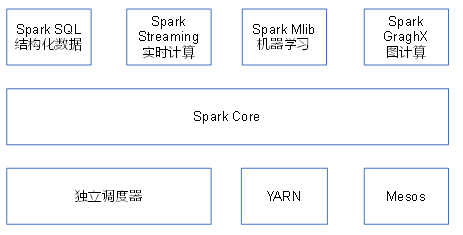

# Spark

Spark是一种基于内存的快速、通用、可扩展的大数据分析计算引擎

## 内置模块



- Spark Core: 实现了Spark的基本功能，包含任务调度、内存管理、错误恢复、与存储系统交互等模块。Spark Core中还包含了对弹性分布式数据集(Resilient Distributed DataSet，简称RDD)的API定义。
- Spark SQL: 是Spark用来操作结构化数据的程序包。通过Spark SQL，我们可以使用 SQL或者Apache Hive版本的HQL来查询数据。Spark SQL支持多种数据源，比如Hive表、Parquet以及JSON等。
- Spark Streaming: 是Spark提供的对实时数据进行流式计算的组件。提供了用来操作数据流的API，并且与Spark Core中的 RDD API高度对应。
- Spark MLlib: 提供常见的机器学习功能的程序库。包括分类、回归、聚类、协同过滤等，还提供了模型评估、数据 导入等额外的支持功能。
- Spark GraphX: 主要用于图形并行计算和图挖掘系统的组件。
- 集群管理器: Spark设计为可以高效地在一个计算节点到数千个计算节点之间伸缩计算。为了实现这样的要求，同时获得最大灵活性，Spark支持在各种集群管理器(Cluster Manager)上运行，包括Hadoop YARN、Apache Mesos，以及Spark自带的调度器Standalone。

## Spark Core

### RDD特性
RDD(Resilient Distributed Dataset)叫做弹性分布式数据集，是Spark中最基本的数据抽象。

- 分区(Partition): 每个RDD被分为多个分区(Partitions)，这些分区运行在集群的不同节点上，每个分区都会被一个计算任务处理，分区数决定并行计算的数量。用户可以在创建RDD时指定RDD的分片个数，如果没有指定，那么就会采用默认值。默认值就是程序所分配到的CPU Core的数目(设置的最大core数)。
- 计算函数(Compute Function): 一个计算每个分区的函数。RDD逻辑上是分区的，每个分区的数据是抽象存在的，计算的时候会通过一个compute函数得到每个分区的数据。
- 依赖关系(Dependency): RDD的每次转换都会生成一个新的RDD，所以RDD之间就会形成类似于流水线一样的前后依赖关系【窄依赖(一对一)，宽依赖(多对多)】。在部分分区数据丢失时，Spark可以通过这个依赖关系重新计算丢失的分区数据，而不是对RDD的所有分区进行重新计算。
- 分区器(Partitioner): 对于键值对RDD，可以使用分区器来决定数据分片的存储位置，通常根据键的哈希值进行分区。
- 分区优先位置(Preferred Locations): 优先位置列表会存储存取每个Partition的优先位置。对于一个HDFS文件来说，这个列表存储的是每个Partition所在块的位置。按照“移动数据不如移动计算”的理念，Spark在进行任务调度的时候，会尽可能地将计算任务分配到其所要处理数据块的存储位置。

### RDD编程

#### 引入依赖

```xml
<dependency>
    <groupId>org.apache.spark</groupId>
    <artifactId>spark-core_2.12</artifactId>
    <version>${spark.version}</version>
</dependency>
```

#### 创建RDD

在Spark中创建RDD的创建方式可以分为三种：从集合中创建RDD、从外部存储创建RDD、从其他RDD创建

```java
public class RDDApplication {
    public static void main(String[] args) {
        // 1.创建配置对象
        SparkConf conf = new SparkConf().setMaster("local[*]").setAppName("sparkCore");

        // 2. 创建sparkContext
        JavaSparkContext sc = new JavaSparkContext(conf);

        // 3.1 从集合创建
        JavaRDD<String> collectRDD = sc.parallelize(Arrays.asList("hadoop", "spark"));
        List<String> collectList = collectRDD.collect();
        collectList.forEach(System.out::println);

        // 3.2 从外部存储创建
        JavaRDD<String> fileRDD = sc.textFile("input");

        // 3.3 其他RDD转换
        JavaRDD<String> transformRDD = collectRDD.map((Function<String, String>) s -> s.toUpperCase());

        // 4. 关闭sc
        sc.stop();
    }
}
```

#### 转换算子
Transformation转换算子又可以分为Value和Key-Value两类。但是Key-Value类型的算子首先需要使用特定的方法转换为PairRDD

- Value类型: map,flatMap,filter,distinct,groupBy,sortBy
  ```java
    public class RDDApplication {
    public static void main(String[] args) {
    // 1.创建配置对象
    SparkConf conf = new SparkConf().setMaster("local[*]").setAppName("sparkCore");
    
            // 2. 创建sparkContext
            JavaSparkContext sc = new JavaSparkContext(conf);
    
            // 3. 基于集合创建RDD
            JavaRDD<String> collectRDD = sc.parallelize(Arrays.asList("hadoop", "spark"));
            
            // map映射
            JavaRDD<String> mapRDD = collectRDD.map((Function<String, String>) s -> s.toUpperCase());
            // flatMap扁平化
            JavaRDD<String> flatMapRDD = collectRDD.flatMap(
                    (FlatMapFunction<String, String>) s -> Arrays.stream(s.split(" ")).iterator()
            );
            // filter过滤
            JavaRDD<String> filterRDD = collectRDD.filter((Function<String, Boolean>) s -> s.length() == 6);
            // distinct去重
            JavaRDD<String> distinctRDD = collectRDD.distinct();
            // groupBy
            JavaPairRDD<String, Iterable<String>> groupByJavaPairRDD = collectRDD.groupBy((Function<String, String>) s -> s);
            // sortBy (1)排序字段  (2) true为正序  (3) 排序之后的分区个数
            JavaRDD<String> sortByRDD = collectRDD.sortBy((Function<String, String>) s -> s, true, 2);
    
            // 4. 关闭sc
            sc.stop();
        }
    }
    ```
- Key-Value类型: mapValues,groupByKey,reduceByKey,sortByKey
  ```java
    public class RDDApplication {
    public static void main(String[] args) {
    // 1.创建配置对象
    SparkConf conf = new SparkConf().setMaster("local[*]").setAppName("sparkCore");
    
            // 2. 创建sparkContext
            JavaSparkContext sc = new JavaSparkContext(conf);
    
            // 3. 基于集合创建RDD
            JavaRDD<String> collectRDD = sc.parallelize(Arrays.asList("hadoop", "spark"));
            // 转换为PairRDD
            JavaPairRDD<String, Integer> pairRDD = collectRDD.mapToPair(
                    (PairFunction<String, String, Integer>) s -> new Tuple2<>(s, 1)
            );
            
            // 4. 关闭sc
            sc.stop();
        }
    }
    ```
#### Action行动算子
转换算子都是懒加载，并不会立即执行，而真正触发整个作业的执行的则是行动算子

主要包括: collect,count,first,take,countByValue,countByKey,saveAsTextFile,foreach,foreachPartition

```java
public class RDDApplication {
    public static void main(String[] args) {
        // 1.创建配置对象
        SparkConf conf = new SparkConf().setMaster("local[*]").setAppName("sparkCore");

        // 2. 创建sparkContext
        JavaSparkContext sc = new JavaSparkContext(conf);

        // 3. 基于集合创建RDD
        JavaRDD<String> collectRDD = sc.parallelize(Arrays.asList("hadoop", "spark"));
        // collect 以数组形式返回
        List<String> collect = collectRDD.collect();
        // count 返回RDD中元素个数
        long count = collectRDD.count();
        // first 返回RDD中第一个元素
        String first = collectRDD.first();
        // take 返回RDD中前N个元素组成的数组
        List<String> take = collectRDD.take(2);
        // countByValue 计数
        Map<String, Long> stringLongMap = collectRDD.countByValue();
        // save 保存为TXT文件
        collectRDD.saveAsTextFile("output");
        // foreach 遍历RDD中每个元素
        collectRDD.foreach(System.out::println);
        // foreachPartition 遍历RDD中每个分区
        collectRDD.foreachPartition(new VoidFunction<Iterator<String>>() {
            @Override
            public void call(Iterator<String> integerIterator) throws Exception {
                // 一次处理一个分区的数据
                while (integerIterator.hasNext()) {
                    String next = integerIterator.next();
                    System.out.println(next);
                }
            }
        });

        // 4. 关闭sc
        sc.stop();
    }
}
```

#### WordCount实例

```java
public class WordCountApplication {
  public static void main(String[] args) {
    String inputPath = args[0];
    String outputPath = args[1];
    // 1.创建配置对象
    SparkConf conf = new SparkConf().setMaster("local").setAppName("sparkCore");

    // 2. 创建sparkContext
    JavaSparkContext sc = new JavaSparkContext(conf);

    // 3. 编写代码
    // 读取数据
    JavaRDD<String> javaRDD = sc.textFile(inputPath);

    // 长字符串切分为单个单词
    JavaRDD<String> flatMapRDD = javaRDD.flatMap(
            (FlatMapFunction<String, String>) s -> Arrays.stream(s.split(" ")).iterator()
    );

    // 转换格式为  (单词,1)
    JavaPairRDD<String, Integer> pairRDD = flatMapRDD.mapToPair(
            (PairFunction<String, String, Integer>) s -> new Tuple2<>(s, 1)
    );

    // 合并相同单词
    JavaPairRDD<String, Integer> javaPairRDD = pairRDD.reduceByKey(
            (Function2<Integer, Integer, Integer>) (v1, v2) -> v1 + v2
    );

    javaPairRDD.collect().forEach(System.out::println);
    javaPairRDD.saveAsTextFile(outputPath);
    // 4. 关闭sc
    sc.stop();
  }
}
```

执行任务  
```shell
bin/spark-submit \
--class com.example.sparkexamples.WordCountApplication \
--master local \
./spark-examples-0.0.1-SNAPSHOT.jar \
./input.txt \
./output
```

## Spark SQL
Spark SQL是用于结构化数据处理的Spark模块。与基本的Spark RDD API不同，Spark SQL提供的接口为Spark提供了有关数据结构和正在执行的计算的更多信息。
在内部，Spark SQL使用这些额外的信息来执行额外的优化。与Spark SQL交互的方式有多种，包括SQL和Dataset API。
计算结果时，使用相同的执行引擎，与您用于表达计算的API/语言无关。

### 引入依赖

```shell
<dependencies>
    <dependency>
        <groupId>org.apache.spark</groupId>
        <artifactId>spark-core_2.12</artifactId>
        <version>${spark.version}</version>
    </dependency>

    <dependency>
        <groupId>org.apache.spark</groupId>
        <artifactId>spark-sql_2.12</artifactId>
        <version>${spark.version}</version>
    </dependency>
</dependencies>
```

### RDD VS DataFrame VS DataSet


### MySQL读写实例

```java
public class MySQLApplication {
    public static void main(String[] args) {
        //1. 创建配置对象
        SparkConf conf = new SparkConf().setAppName("sparksql").setMaster("local[*]");

        //2. 获取sparkSession
        SparkSession spark = SparkSession.builder().config(conf).getOrCreate();

        //3. 编写代码

        // 3.1 配置连接参数
        Properties properties = new Properties();
        properties.setProperty("user", "root");
        properties.setProperty("password", "root");

        // 3.2 读取表数据
        Dataset<Row> lineDS = spark.read()
                .jdbc("jdbc:mysql://127.0.0.1:3306/dbname", "t1", properties);
        // 3.3 创建临时视图
        lineDS.createOrReplaceTempView("node_1");
        lineDS = spark.sql("select * from node_1 limit 100");
        lineDS.createOrReplaceTempView("node_2");
        lineDS = spark.sql("select * from node_2 order by id");
        lineDS.show();

        // 写入
        lineDS.write()
                .mode(SaveMode.Append)
                .jdbc("jdbc:mysql://127.0.0.1:3306/dbname", "t2", properties);

        //4. 关闭sparkSession
        spark.close();
    }
}
```