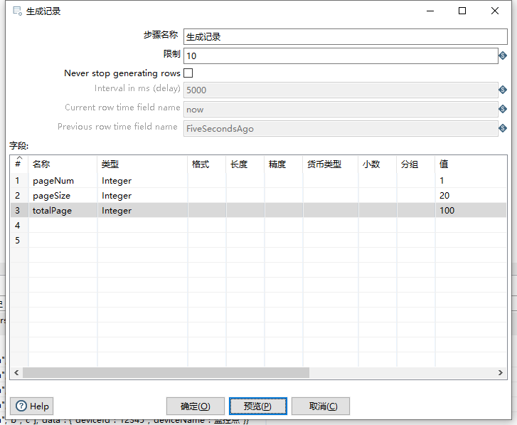
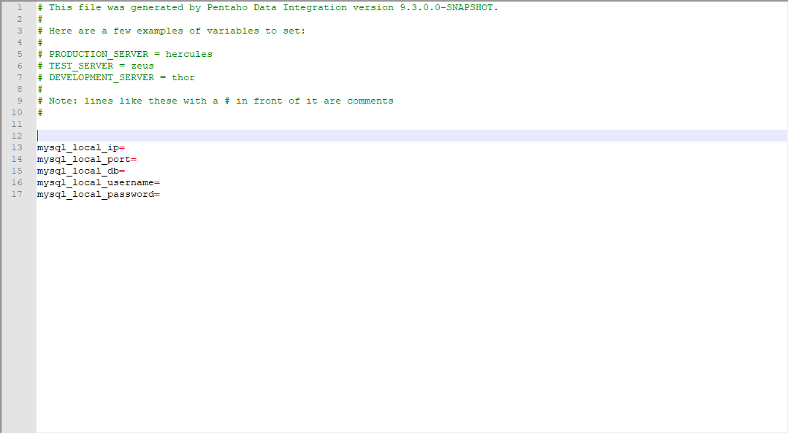
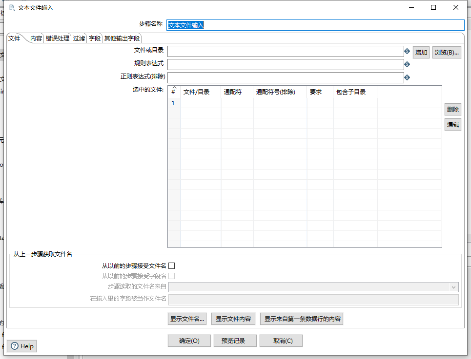
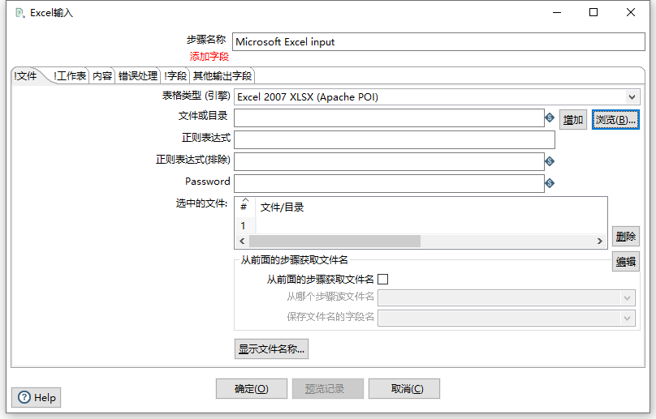
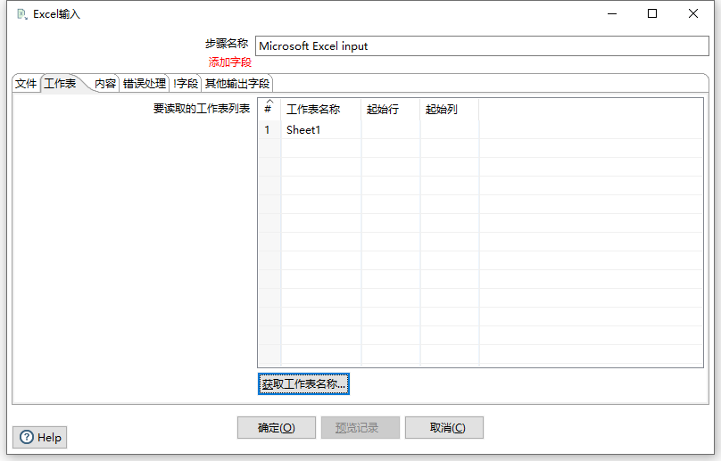
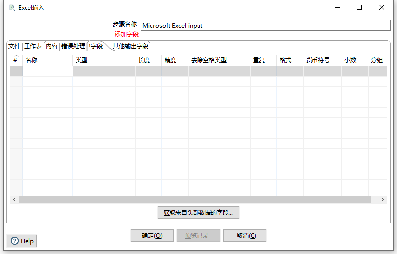
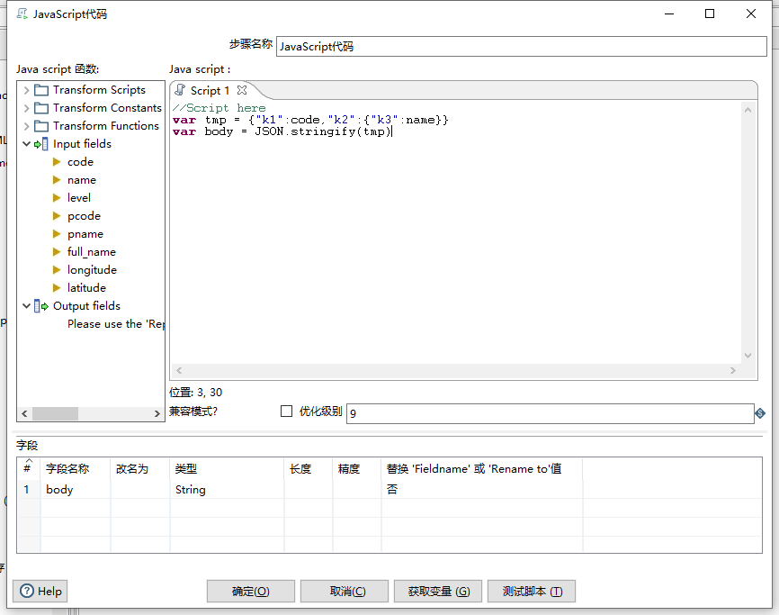
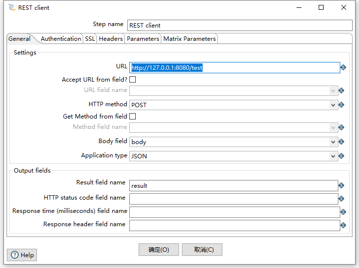

# Pentaho Kettle
Kettle是一款由纯Java语言开发的免费开源的ETL工具,ETL即是Extract-Transform-Load的缩写,
用来描述将数据从来源端通过提取(Extract)、转换(Transform)、加载(Load)到目标端的过程, 通常用于数据清洗、数据迁移等.

## 安装和部署
Github地址: https://github.com/pentaho/pentaho-kettle
下载地址: https://sourceforge.net/projects/pentaho/

1. JDK11 安装部署
2. Kettle 安装部署

安装完成后,我们需要关注Kettle的几个关键目录和文件

- Spoon：图形界面工具，快速设计和维护复杂的ETL工作流。
- Kitchen：运行作业的命令行工具。
- Pan：运行转换的命令行工具。
- Carte：轻量级的（大概1MB）Web服务器，用来远程执行转换或作业。一个运行有Carte进程的机器可以作为从服务器，从服务器是Kettle集群的一部分。
- lib:该目录是Kettle依赖的第三方jar包目录,如果我们在使用Kettle进行数据库导入的话,此时如果Kettle中没有该数据库的驱动jar包时,我们需要将从网站上下载的驱动jar放到该lib目录下,然后重启程序进行调试,否则会报错(驱动类不存在)
- Encr:上面我们所说的创建数据库连接时,我们需要输入密码,但是我们的密码不能是明文,Encr工具为我们提供加密服务

## 核心概念
Kettle中两个核心的组件服务：转换和作业

- 转换：转换(transformation)是ETL解决方案中最主要的部分,它负责抽取、转换、加载各个阶段的数据操作处理,转换包括一个或多个步骤,
如读取文件、请求REST接口、插入数据、过滤数据等等,各个步骤之间通过Hop连接,Hop代表的是一个单向的数据流通道。通过:文件 => 新建 => 转换用以创建转换
- 作业：一个作业包含一个或者多个作业项，作业项可以是转换也可以是作业，这些作业项以串行顺序来执行。作业执行顺序由作业项之间的跳（job hop）和每个作业项的执行结果来决定。通过:文件 => 新建 => 作业用以创建作业
- 跳：步骤间带箭头的连线
- 步骤（控件）：是转换里的基本组成部分。特性如下：  
  i. 步骤名称在转换范围内唯一  
  ii. 每个步骤都会读、写数据行（生成记录例外，生成记录只写数据）  
  iii. 步骤间通过跳连接
  iv. 大多数步骤可以有多个输出跳，在多个输出跳时可以选择分发或复制
- 元数据：每个步骤在输出行都有对字段的描述，这种描述就是数据行的元数据  
  i. 名称，数据行中的字段名是唯一的  
  ii. 数据类型，字段的数据类型  
  iii. 格式，数据显示方式，例如Integer的#，0，0.00。  
  iv. 长度，字符串或BigNumber的长度  
  v. 精度，BigNumber数据类型的十进制精度
- 并行：对于kettle的转换，不能定义一个执行顺序，因为所有步骤都以并发方式执行：当转换启动后，所有步骤都同时启动，从它们的输入跳中读取数据，并把处理过的数据写到输出跳，直到输入跳里不再有数据，就中止步骤的运行。当所有的步骤都中止了，整个转换就中止了。

## 参数与变量

### 临时变量
临时变量仅作用于当前作业或转换。  

**生成记录**


### 全局变量
全局变量在当前环境下任意作业和转换中生效。在配置文件`${KETTLE_HOME}/.kettle/kettle.properties`中定义变量名称和值


### 获取变量
- 通过`${}`符号来引用,例如 `${mysql_local_ip}`
- 通过两个百分号来引用,例如 `%mysql_local_ip%`


## 输入控件

输入是转换里面的第一个分类，输入控件也是转换中的第一大控件，用来抽取数据或者生成数据。输入是ETL里面的E（Extract），主要做数据提取的工作。

### CSV文件输入


- 步骤名称: 同一个转换内需要保证唯一性
- 文件名: 选择对应的CSV文件
- 列分隔符: 默认逗号
- 包含列头行: 文件第一行是表头信息
- 文件编码: 预览数据出现乱码则可以更改文件编码

### 文本文件输入


### Excel输入


1. 选择对应的表格类型 `.xls`或`.xlsx`
2. 选择对应的Excel文件并增加


获取Excel的Sheet表名称


获取字段并设置字段类型

### XML输入

1.	浏览获取xml文件，并添加
2.	获取xml文档的所有路径，设置合适的循环读取路径
3.	获取字段，获得自己想要读取的所有字段，并且设置适当的格式

### JSON输入

JSON Path语法

| 语法                    | 含义                       |
|-----------------------|--------------------------|
| `$`                   | 表示根节点                    |
| `@`                   | 当前节点                     |
| `.<节点名称>`             | 	获取子节点                   |
| `[<节点名称1>(,<节点名称2>)]` | 	获取子节点，与点号不同，这里可以获取多个子节点 |
| `*`                   | 	匹配所有元素节点                |
| `..`	                 | 获取子孙节点，无论嵌套多少层，都可以获取到    |
| `[<下标1>(,<下标2>)]`     | 	表示一个或多个下标               |
| `[start:end:step]`    | 	表示切片语法                  |
| `[?(<表达式>)]`          | 	过滤器表达式，表达式结果必须是布尔值      |
| `()`	                 | 支持表达式计算                  |


1.	浏览获取JSON文件并添加/选择上一个步骤中的字段源
2.	根据JSON Path点记法，获取到需要的字段，并且设置合适格式

### 表输入

1. 数据库驱动配置: 创建数据库连接之前需要将数据库驱动放置在Kettle安装目录的lib文件夹下，并重启客户端
2. 创建数据库连接: 菜单路径：主对象树 => 转换 => DB连接，右键新建，填写数据库连接并测试
3. 表输入: 核心对象 => 输入 => 表输入，将 `表输入` 拖动到画布中
4. 输入查询语句: 双击 `表输入`，选择刚才创建的数据库连接，然后在SQL查询框内输入查询语句


## 输出控件

输出是转换里面的第二个分类，输出控件也是转换中的第二大控件，用来存储数据

1. Excel输出：将数据输出成Excel文档
2. 文本文件输出：将数据输出成文本文件
3. SQL文件输出：SQL文件输出一般跟表输入做连接，然后将数据库表的表结构和数据以SQL文件的形式导出
4. 表输出：表输出控件可以将kettle数据行中的数据直接写入到数据库中的表中
5. 更新、插入/更新：更新和插入/更新，这两个控件是kettle提供的将数据库已经存在的记录与数据流里面的记录进行对比的控件
6. 删除：删除控件可以删除数据库表中指定条件的数据，企业里一般用此控件做数据库表数据删除或者跟另外一个表数据做对比，然后进行去重的操作

## Rest Client


1. 通过JavaScript代码构造请求体
   
2. 配置RestClient组件
   
3. JSON input解析返回值
   

## 转换控件

转换控件是转换里面的第四个分类，转换控件也是转换中的第三大控件，用来转换数据。转换是ETL里面的T（Transform），主要做数据转换，数据清洗的工作。

1. Concat fields：将多个字段连接起来形成新的字段
2. Value mapper：将字段的值映射成其他值，例如将man映射成男，woman映射成女
3. add constants：在本身的数据流里面添加一列数据，该列的数据都是相同的值
4. 增加序列：给数据流添加一个序列字段，可以自定义该序列字段的递增步长
5. 字段选择：字段选择是从数据流中选择字段、改变名称、修改数据类型
6. 剪切字符串：指定输入流字段裁剪的位置剪切出新的字段
7. 字符串替换：指定搜索内容和替换内容，如果输入流的字段匹配上搜索内容就进行替换生成新字段
8. 字符串操作：去除字符串两端的空格和大小写切换，并生成新的字段
9. 排序记录&去除重复记录：去除重复记录是去除数据流里面相同的数据行。但是此控件使用之前要求必须先对数据进行排序，对数据排序用的控件是排序记录，排序记录控件可以按照指定字段的升序或者降序对数据流进行排序。因此排序记录+去除重复记录控件常常配合组队使用
10. 唯一行：唯一行（哈希值）就是删除数据流重复的行。此控件的效果和（排序记录+去除重复记录）的效果是一样的，但是实现的原理不同。排序记录+去除重复记录对比的是每两行之间的数据，而唯一行（哈希值）是给每一行的数据建立哈希值，通过哈希值来比较数据是否重复，因此唯一行（哈希值）去重效率比较高，也更建议大家使用
11. 列拆分为多行：列拆分为多行就是把指定字段按指定分隔符进行拆分为多行，然后其他字段直接复制

## 流程控件
流程分类下的控件主要用来控制数据流程和数据流向

1. Switch/case：Switch/case控件，最典型的数据分类控件，可以利用某一个字段的数据的不同的值，让数据流从一路到多路
2. 过滤记录：过滤记录相当于if-else，可以自定义输入一个判断条件，然后将数据流中的数据一路分为两路
3. 空操作：顾名思义就是什么也不做，一般作为数据流的终点
4. 中止：中止是数据流的终点，如果有数据流到此控件处，整个转换程序将中止，并且在控制台输出报错信息。此控件一般用来校验数据，或者调试程序

### 连接控件

连接分类下的控件一般都是将多个数据集通过关键字进行连接起来，形成一个数据集的过程。

#### 合并记录(垂直连接)
合并记录是用于将两个不同来源的数据合并，这两个来源的数据分别为旧数据和新数据，该步骤将旧数据和新数据按照指定的关键字匹配、比较、合并。
注意旧数据和新数据需要事先按照关键字段排序，并且旧数据和新数据要有相同的字段名称。

1.	旧数据源：选择旧数据来源的步骤
2.	新数据源：选择新数据来源的步骤
3.	标志字段：设置标志字段的名称，标志字段用于保存比较的结果，比较结果有下列几种
      1. "identical" – 旧数据和新数据一样
      2. "changed" – 数据发生了变化;
      3. "new" – 新数据中有而旧数据中没有的记录
      4. "deleted" –旧数据中有而新数据中没有的记录
4.	关键字段：用于定位判断两个数据源中的同一条记录的字段，也就是唯一键
5.	数据字段：对于两个数据源中的同一条记录，指定需要比较的字段（影响标志字段）

#### Merge join(水平连接)

记录集连接可以对两个步骤中的数据流进行左连接，右连接，内连接，外连接。
注意在进行记录集连接之前，需要对记录集的数据进行排序，并且排序的字段还一定要选两个表关联的字段。

## 作业

### 作业项

作业项是作业的基本构成部分。如同转换的步骤，作业项也可以使用图标的方式图形化展示。但是，作业项和转换步骤有下面几点不同：  
1.	转换步骤与步骤之间是数据流，作业项之间是步骤流。
2.	转换启动以后，所有步骤一起并行启动等待数据行的输入，而作业项是严格按照执行顺序启动，一个作业项执行完以后，再执行下一个作业项。
3.	在作业项之间可以传递一个结果对象（result object）。这个结果对象里面包含了数据行，它们不是以数据流的方式来传递的。而是等待一个作业项执行完了，再传递个下一个作业项。
4.	因为作业顺序执行作业项，所以必须定义一个起点。有一个叫“开始”的作业项就定义了这个点。一个作业只能定一个开始作业项。

### 作业跳

作业的跳是作业项之间的连接线，他定义了作业的执行路径。作业里每个作业项的不同运行结果决定了做作业的不同执行路径。作业跳一共分为下面三种情况：  
1. 无条件执行：不论上一个作业项执行成功还是失败，下一个作业项都会执行。这是一种蓝色的连接线，上面有一个锁的图标。
2. 当运行结果为真时执行：当上一个作业项的执行结果为真时，执行下一个作业项。通常在需要无错误执行的情况下使用。这是一种绿色的连接线，上面有一个对钩号的图标。
3. 当运行结果为假时执行：当上一个作业项的执行结果为假或者没有成功执行是，执行下一个作业项。这是一种红色的连接线，上面有一个红色的停止图标。


## 命令行执行

### 转换执行工具

```shell
pan.sh -file=test.ktr -logfile=test.log -level=RowLevel
```

### 作业执行工具

```shell
kitchen.sh -file=test.kjb -logfile=test.log -level=Rowlevel
```
