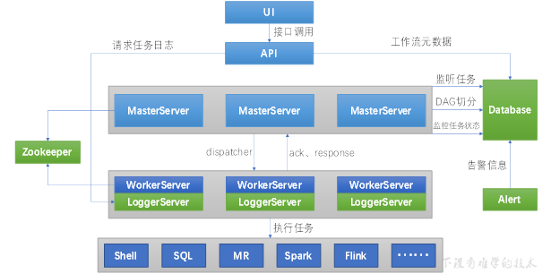

# DolphinScheduler分布式部署

Apache DolphinScheduler是一个分布式、易扩展的可视化DAG工作流任务调度平台。
致力于解决数据处理流程中错综复杂的依赖关系，使调度系统在数据处理流程中开箱即用。

## 核心概念

DolphinScheduler的主要角色如下:

- MasterServer采用分布式无中心设计理念，MasterServer主要负责 DAG 任务切分、任务提交、任务监控，并同时监听其它MasterServer和WorkerServer的健康状态。
- WorkerServer也采用分布式无中心设计理念，WorkerServer主要负责任务的执行和提供日志服务。
- ZooKeeper服务，系统中的MasterServer和WorkerServer节点都通过ZooKeeper来进行集群管理和容错。
- Alert服务，提供告警相关服务。
- API接口层，主要负责处理前端UI层的请求。
- UI，系统的前端页面，提供系统的各种可视化操作界面。



## 集群规划

| hadoop101     | hadoop102 | hadoop103 |
|---------------|-----------|-----------|
| master、worker | worker    | worker    |

## 前置准备

1. 三台节点均需部署JDK，并配置环境变量
2. 需部署数据库，支持MySQL（5.7+）或者PostgreSQL（8.2.15+）。
3. 需部署Zookeeper（3.4.6+）。
4. 如果启用 HDFS 文件系统，则需要 Hadoop（2.6+）环境。
5. 三台节点均需安装进程树分析工具psmisc
   ```shell
   sudo yum install -y psmisc
   ```
   
## 解压安装

```shell
tar -zxvf apache-dolphinscheduler-2.0.5-bin.tar.gz -C /opt/module/

cd /opt/module/apache-dolphinscheduler-2.0.5-bin
# 编辑安装部署脚本
vim conf/config/install_config.conf
```

需要修改的内容如下
```properties
# 将要部署任一 DolphinScheduler 服务的服务器主机名或 ip 列表
ips="hadoop101,hadoop102,hadoop103"
# master 所在主机名列表，必须是 ips 的子集
masters="hadoop101"
# worker主机名及队列，此处的 ip 必须在 ips 列表中
workers="hadoop101:default,hadoop102:default,hadoop103:default"
# 告警服务所在服务器主机名
alertServer="hadoop101"
# api服务所在服务器主机名
apiServers="hadoop101"

# 需要注释 pythonGatewayServers
# pythonGatewayServers="ds1"

# DS 安装路径，如果不存在会创建
installPath="/opt/module/dolphinscheduler"
# 部署用户，任务执行服务是以 sudo -u {linux-user} 切换不同 Linux 用户的方式来实现多租户运行作业，因此该用户必须有免密的 sudo 权限
deployUser="hadoop"
# 前文配置的所有节点的本地数据存储路径，需要确保部署用户拥有该目录的读写权限
dataBasedirPath="/tmp/dolphinscheduler"
# JAVA_HOME 路径
javaHome="/usr/lib/jvm/java-1.8.0-openjdk"
# DolphinScheduler UI 默认端口号
apiServerPort="12345"
DATABASE_TYPE="mysql"
# 数据库类型
# 数据库 URL
SPRING_DATASOURCE_URL="jdbc:mysql://hadoop101:3306/dolphinscheduler?useUnicode=true&characterEncoding=UTF-8"
# 数据库用户名
SPRING_DATASOURCE_USERNAME="dolphinscheduler"
# 数据库密码
SPRING_DATASOURCE_PASSWORD="dolphinscheduler"
# 注册中心插件名称，DS 通过注册中心来确保集群配置的一致性
registryPluginName="zookeeper"
# 注册中心地址，即 Zookeeper 集群的地址
registryServers="hadoop101:2181,hadoop102:2181,hadoop103:2181"
# DS 在 Zookeeper 的结点名称
registryNamespace="dolphinscheduler"
taskPluginDir="lib/plugin/task"
# 资源存储类型
resourceStorageType="HDFS"
# 资源上传路径
resourceUploadPath="/dolphinscheduler"
# 默认文件系统
defaultFS="hdfs://hadoop101:8020"
# yarn RM http 访问端口
resourceManagerHttpAddressPort="8088"
# Yarn RM 高可用 ip，若未启用 RM 高可用，则将该值置空
yarnHaIps=
# Yarn RM 主机名，若启用了 HA 或未启用 RM，保留默认值
singleYarnIp="hadoop102"
# 拥有 HDFS 根目录操作权限的用户
hdfsRootUser="hadoop"
```


1. 添加MySQL驱动
   ```shell
   cp mysql-connector-j-8.0.31.jar lib/
   ```
2. 创建数据库
   ```shell
   # 创建数据库
   mysql> CREATE DATABASE dolphinscheduler DEFAULT CHARACTER SET utf8 DEFAULT COLLATE utf8_general_ci;
   # 创建数据库用户,并授予远程连接权限
   mysql> create user 'dolphinscheduler'@'%' identified by 'dolphinscheduler';
   # 为用户授权数据库权限
   mysql> grant all privileges on dolphinscheduler.* to 'dolphinscheduler'@'%';
   # 刷新权限
   mysql> flush privileges;
   ```
3. 执行数据库初始化脚本
   ```shell
   script/create-dolphinscheduler.sh
   ```
4. 一键部署
   ```shell
   ./install.sh
   ```
5. 查看DolphinScheduler进程
   ```shell
   --------- hadoop101 ----------
   29139 ApiApplicationServer
   28963 WorkerServer
   3332 QuorumPeerMain
   2100 DataNode
   28902 MasterServer
   29081 AlertServer
   1978 NameNode
   29018 LoggerServer
   2493 NodeManager
   29551 Jps
   --------- hadoop102 ----------
   29568 Jps
   29315 WorkerServer
   2149 NodeManager
   1977 ResourceManager
   2969 QuorumPeerMain
   29372 LoggerServer
   1903 DataNode
   --------- hadoop103 ----------
   1905 SecondaryNameNode
   27074 WorkerServer
   2050 NodeManager
   2630 QuorumPeerMain
   1817 DataNode
   27354 Jps
   27133 LoggerServer
   ```
6. 访问DolphinScheduler UI  
   DolphinScheduler UI地址为 `http://hadoop101:12345/dolphinscheduler`
   初始用户的用户名为：`admin`，密码为 `dolphinscheduler123`