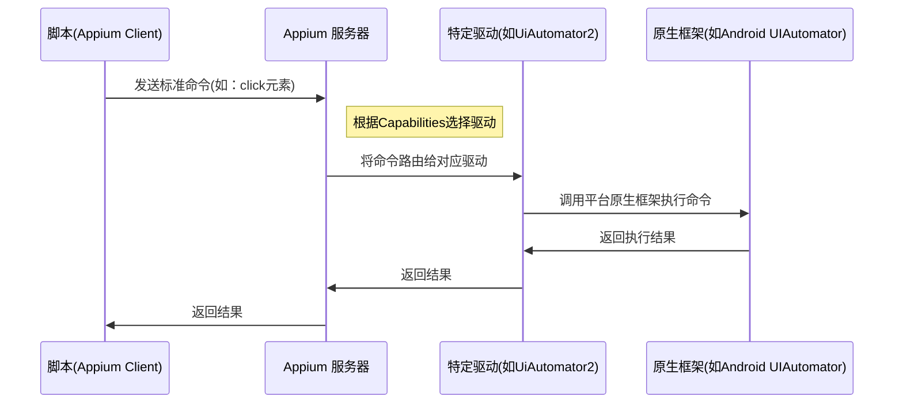

# Appium

Appium 是一个开源的移动端自动化测试框架，主要用于自动化测试原生、混合和移动 Web 应用程序。
它支持 iOS 和 Android 平台，使用 WebDriver 协议来实现跨平台的移动应用测试。



## 安装部署

### Appium

1. 安装node(最新长期支持版本LTS) `https://nodejs.org/zh-cn/download`
2. 添加node环境变量
3. npm安装Appium `npm install -g appium`
4. 验证安装 `appium -v`
5. 安装环境检查工具 `npm install -g appium-doctor`
6. 检查环境配置 `appium-doctor --android`

启动命令 `appium`, 默认端口 4723

### 驱动安装
Appium 本身不直接与 Android 或 iOS 设备交互。它定义了一套标准的 WebDriver 协议，驱动负责具体的命令的执行

```shell
# 安装UiAutomator2驱动（Android）
appium driver install uiautomator2

# 安装XCUITest驱动（iOS）
appium driver install xcuitest
```

### Android SDK 环境配置
Appium 依赖 Android SDK 中的工具（如 adb）

1. 下载 Android Studio，`https://developer.android.com/studio`
2. 安装 SDK 平台工具： 打开 Android Studio，进入 SDK Manager，安装以下内容：
   - Android SDK Platform-Tools（包含 adb 等关键工具）
   - Android SDK Build-Tools
   - 对应手机Android版本 Android Platform（例如 Android 13 (API 33)）
3. 配置环境变量：
   - ANDROID_HOME： 指向你的 Android SDK 根目录（例如 C:\Users\YourName\AppData\Local\Android\Sdk）。
   - PATH 新增 `%ANDROID_HOME%\platform-tools` adb工具 与 `%ANDROID_HOME%\tools` 其他工具

### 安卓手机配置

1. 开启开发者选项：
   1. 进入手机的“设置” > “关于手机”
   2. 连续点击“版本号”N次，直到提示“您已处于开发者模式”
2. 开启 USB 调试：
   1. 返回设置，找到新出现的“开发者选项”
   2. 开启“USB 调试”开关
3. 连接电脑：
   1. 使用 USB 数据线连接手机和电脑。
   2. 在手机上弹出的“允许USB调试吗？”对话框中，选择“允许”，并勾选“始终允许”
4. 连接与验证，打开终端或命令提示符 `adb devices` 正确显示真实设备列表


### 客户端
Appium 其实是一个HTTP服务器而已，它需要与客户端进行连接，并由客户端发出指令告诉它应该开启哪种会话，还有一旦会话启动成功后该进行哪些自动化操作。

安装客户端，这里选择Python版本 `pip install Appium-Python-Client`

Python 示例
```python
# 导入必要的库
from appium import webdriver
from appium.options.android import UiAutomator2Options
from appium.webdriver.common.appiumby import AppiumBy
import time

# 定义 Desired Capabilities
options = UiAutomator2Options()
options.load_capabilities({
      'platformName': 'Android',        # 移动设备平台（Android/iOS）
      'platformVersion': '13',          # 手机安卓系统版本（需根据你的设备修改）
      'deviceName': 'Android Phone',    # 设备名称，可自定义，用于日志
      'automationName': 'UiAutomator2', # 使用的自动化引擎（Android 推荐）
      'appPackage': 'com.android.settings', # 要测试的App包名（这里是系统设置）
      'appActivity': '.Settings'        # App的启动主界面Activity
})

# 初始化驱动，连接至Appium服务器
driver = webdriver.Remote('http://localhost:4723', options=options)

# 等待界面加载完成（这是一种隐式等待，设置查找元素的超时时间）
driver.implicitly_wait(10)

try:
    # 示例操作：查找并点击“网络和互联网”选项
    # 使用XPath定位元素（这是一种常用的定位方式）
    network_option = driver.find_element(AppiumBy.XPATH, "//*[@text='网络和互联网']")
    network_option.click()
    print("成功点击‘网络和互联网’")

    # 等待2秒，方便观察结果
    time.sleep(2)

    # 示例操作：点击返回键，回到设置主页面
    driver.back()
    print("已返回")

    # 可以继续添加更多操作...
    # 例如：find_element(By.ID, ...).send_keys("text")

finally:
    # 无论测试成功与否，最后都要关闭会话，释放资源
    time.sleep(3)
    driver.quit()
    print("测试结束，驱动已关闭")
```

获取 appPackage 和 appActivity

1. 打开你要测试的 App
2. 在命令行中运行：adb shell dumpsys window | find "mCurrentFocus"
3. 输出类似：mCurrentFocus=Window{... u0 com.android.settings/.Settings}
4. 其中 `com.android.settings` 是 appPackage， `.Settings` 是 appActivity


## Appium Inspector

Appium Inspector 是一个图形化工具，用于查看移动应用的元素层级和属性

- 检查元素：像 Chrome DevTools 一样，查看应用界面的 UI 元素树
- 获取元素属性：获取元素的 resource-id, text, content-desc, class, bounds 等关键信息
- 录制操作：通过点击屏幕录制基本的操作代码（如点击、输入）
- 验证定位策略：在写代码之前，先测试你的 XPath 或其他定位器是否能正确找到元素

下载地址: `https://github.com/appium/appium-inspector/releases`