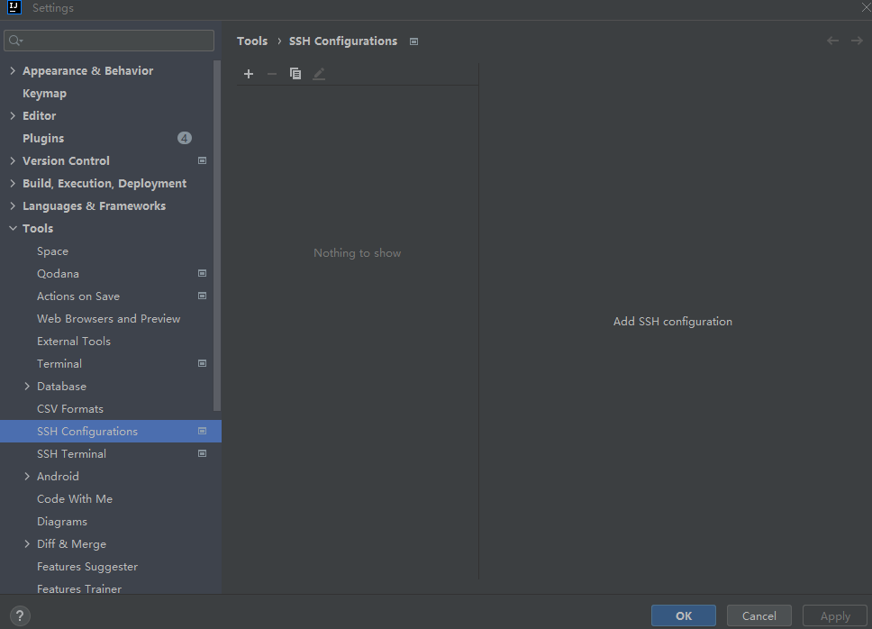
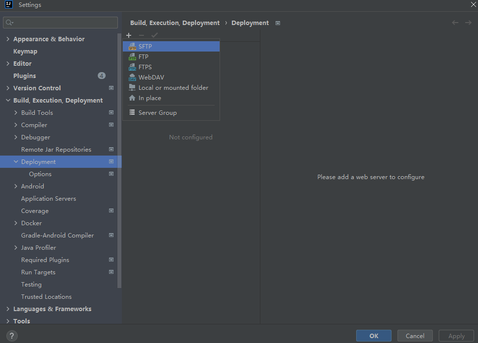
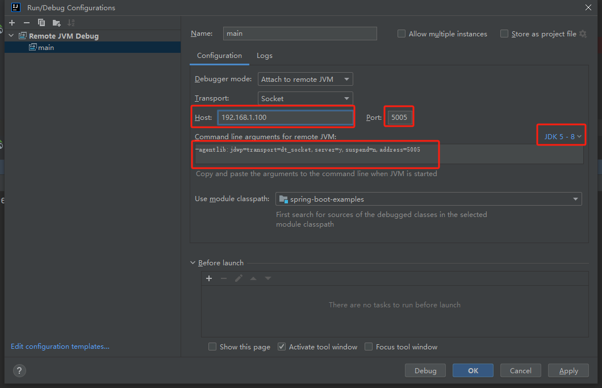

# IDEA 远程开发

## 背景
1. 远程服务器部署应用需手动上传jar包、Dockerfile文件等
2. 远程服务器环境无法Debug

## 远程连接

目的: 在IDEA中创建远程服务器连接
### 连接配置
菜单路径: File => Settings => Tools => SSH Configurations  
  
填写对应远程服务器Host、Port、用户名、密码，连接测试成功后点击Apply保存连接信息。

### 远程终端
菜单路径: Terminal => 下选框 => 选择对应的远程服务器连接  
即可在IDEA完成远程服务器终端创建，启动服务。
```shell
nohup java -jar ./target/spring-boot-examples-0.0.1-SNAPSHOT.jar &
```

## 远程SFTP
目的: 在IDEA中上传文件至远程服务器

### 连接配置
菜单路径: File => Settings => Build, Execution, Deployment => Deployment  
  

#### Connection
配置连接信息
- SSH configuration: 选择我们刚刚配置好的 SSH 信息
- Root Path（选填）: 访问服务器文件的根目录

#### Mappings
配置路径映射
- Local Path: 本地项目路径
- Deployment Path: 远程服务器项目路径

### 查看远程文件列表

菜单路径: Tools => Development => Browse Remote Host

### 手动上传

右键文件或目录，选择 `Deployment => Upload to <Server Name>`

### 开启自动上传(选配)

菜单路径: Tools => Development => Automatic Upload

### 开启自动删除 (选配)
到目前为止，如果我们删除了本地电脑的文件，远程 Linux 服务器的对应文件并不会删除

1. 菜单路径: Tools => Development => Options
2. 勾选 `Delete target items when source ones do not exist` (手动同步生效)
3. 勾选 `Delete remote files when local are deleted` (自动同步生效)

## 远程调试

1. IDEA 右上角编辑配置 `Edit Configurations`
2. 新建远程 JVM Debug 配置 `Remote JVM Debug`
3. 设置Host为远程Java服务器的IP地址或主机名、Port为占用的远程调试端口、选择对应的JDK 版本，IDEA 会自动生成一段远程调试参数
   
4. 在远程终端启动服务(注意点：调试参数需要放在`-jar`前面)  
   ```shell
   java -agentlib:jdwp=transport=dt_socket,server=y,suspend=n,address=*:5005 -jar ./target/spring-boot-examples-0.0.1-SNAPSHOT.jar
   ```
5. IDEA开启Debug

## 远程开发

使用 IDEA 自带的远程开发功能，可以直接将本地的编译、构建、调试、运行等工作全部都放在远程服务器上执行！
而本地仅运行客户端软件连接服务器，像之前一样编写代码、进行其他开发操作即可。

1. 菜单路径: File => Remote Development => SSH
2. 配置SSH连接
3. 指定远程开发的代码路径
4. 首次使用时，需要等待下载 `JetBrains Client` 客户端。同时服务器上也会安装对应远程开发后端
