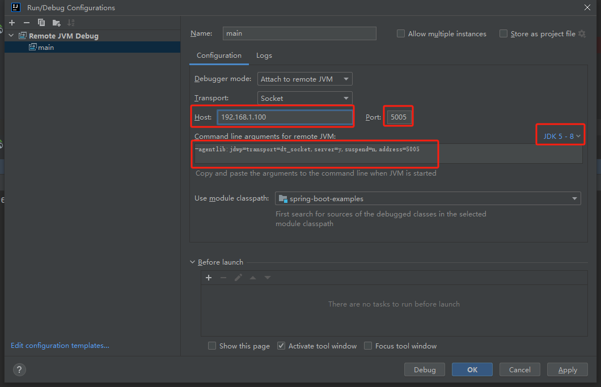

# IDEA 远程开发

## 远程部署

远程部署的思路是在本地编写代码，然后把本地的代码文件定期同步到 `Linux` 服务器，再用本地电脑操作远程服务器完成部署和运行。

### 文件同步

1. 菜单路径: Tools => Development => Configuration
2. 新增SFTP连接，输入Server Name(推荐以服务器IP命名)
3. 配置SSH连接，输入IP，端口，用户名及密码，点击Test Connection进行验证
4. 配置路径映射，点击Mappings，填写本地及远程服务器路径映射  
   - Local Path 本地代码文件路径，例如 `D:\github\spring-boot-examples`
   - Deployment Path 远程服务器文件路径，例如 `/home/app/spring-boot-examples`
5. 点击OK，完成保存

### 查看远程文件列表

菜单路径: Tools => Development => Browse Remote Host

### 开启自动同步

菜单路径: Tools => Development => Automatic Upload

### 同步删除文件
到目前为止，如果我们删除了本地电脑的文件，远程 Linux 服务器的对应文件并不会删除

1. 菜单路径: Tools => Development => Options
2. 勾选 `Delete target items when source ones do not exist` (手动同步)
3. 勾选 `Delete remote files when local are deleted`

### 手动同步

右键左侧文件或目录，选择 `Deployment => Upload to <Server Name>`

### 远程终端

菜单路径: Terminal => v => <远程服务地址>

启动服务: `java -jar ./target/spring-boot-examples-0.0.1-SNAPSHOT.jar`

### 远程调试

1. IDEA 右上角编辑配置 `Edit Configurations`
2. 新建远程 JVM Debug 配置 `Remote JVM Debug`
3. 修改自己虚拟机的 IP、希望占用的远程调试端口、JDK 版本等，IDEA 会自动生成一段远程调试参数
   
4. 在远程终端启动服务(注意点：调试参数需要放在`-jar`前面)  
   ```shell
   java -agentlib:jdwp=transport=dt_socket,server=y,suspend=n,address=5005 -jar ./target/spring-boot-examples-0.0.1-SNAPSHOT.jar
   ```
5. IDEA开启Debug

## 远程开发

使用 IDEA 自带的远程开发功能，可以直接将本地的编译、构建、调试、运行等工作全部都放在远程服务器上执行！
而本地仅运行客户端软件连接服务器，像之前一样编写代码、进行其他开发操作即可。

1. 菜单路径: File => Remote Development => SSH
2. 配置SSH连接
3. 指定远程开发的代码路径
4. 首次使用时，需要等待下载 `JetBrains Client` 客户端。同时服务器上也会安装对应远程开发后端
