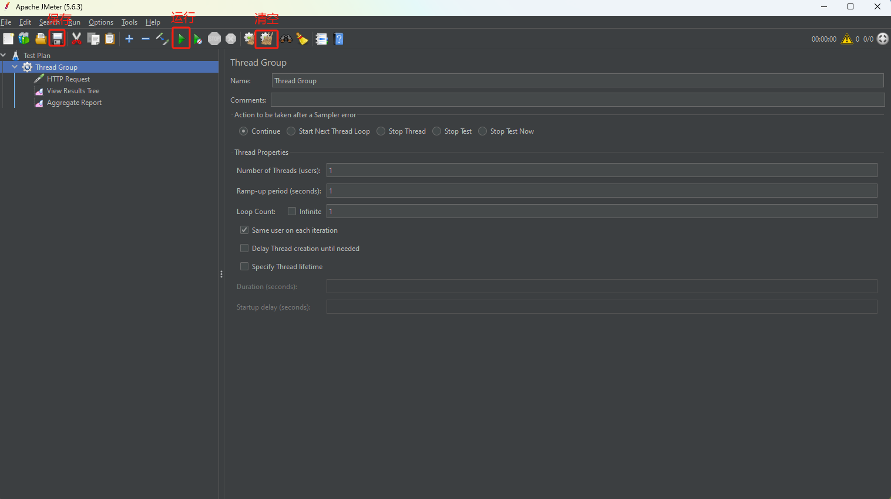

# JMeter
JMeter 是开源软件 Apache 基金会下的一个性能测试工具，用于测试部署在服务器端的应用程序的性能。

## 安装
下载地址: `https://jmeter.apache.org/`

JMeter 是一款免安装的软件，下载安装包后直接解压即可使用。
在 bin 目录下，Windows 用户运行 `jmeter.bat` 文件即可启动 JMeter，Unix / MacOS 用户则需要运行 `jmeter.sh`

## 压测

### 添加虚拟用户组
右击`Test Plan` > `Add` > `Threads(Users)` > `Thread Group`

JMeter 是由 Java 实现的，并且使用一个 Java 线程来模拟一个用户，因此线程组(Thread Group)就是指一组用户的意思。

### 设置线程组参数
1. `Number of Threads(users)`: 指虚拟用户数。默认为 1，则表明模拟一个虚拟用户访问被测系统。如果想模拟 100 个用户，则此处输入 100。
2. `Ramp-Up period(seconds)`: 虚拟用户增长时长。举个例子：比如你测试的是一个考勤系统，实际用户登录使用考勤系统的时候并不是大家一起登录。实际的使用场景可能是 9:00 上班，那么从 8:30 开始，考勤系统会陆陆续续有人开始登录，直到 9:10 左右。如果完全按照用户的使用场景来设计测试，此处应输入 40（分钟）* 60（秒）= 2400。但实际测试一般不会设置如此长的 Ramp-Up 时间，原因是你难道想要等上 40 分钟吗？一般情况下，可以估算出登录频率最高的时间长度，比如此处从 8:55 到 9:00 登录的人最多，那么这里设置为 60秒。如果“线程数”输入为 100，则意味着在 1 分钟内 100 个用户登录完毕
3. `Loop Count`: 循环次数。默认为 1，意味着一个虚拟用户做完一遍事情之后，该虚拟用户停止运行。如果选中“永远”，则意味着测试运行起来之后就根本停不下来了，除非手动停止。

### 配置测试接口

右击`Thread Group` > `Add` > `Sampler` > `HTTP Request`

### POST JSON
右击`Thread Group` > `Add` > `Config Element` > `HTTP Header Manager`  
1. `HTTP Request` 选择 `Body Data`，输入请求参数
2. `HTTP Header Manager` 新增Header，Name: `Content-Type`，Value: `application/json`

### 设置请求参数
1. Name: 测试接口的描述性文字
2. Protocol: 协议类型http,https
3. Server Name Or IP: 域名或IP
4. Port Number: 端口号

### 添加结果监听器

右击`Thread Group` > `Add` > `Listener` > `View Results Tree`来查看性能测试过程中请求和响应信息

### 添加汇总报告

右击`Thread Group` > `Add` > `Listener` > `Aggregate Report`来查看性能测试过程中请求和响应信息

### 保存与运行测试

先点击"保存"按钮；然后点击"运行"按钮

