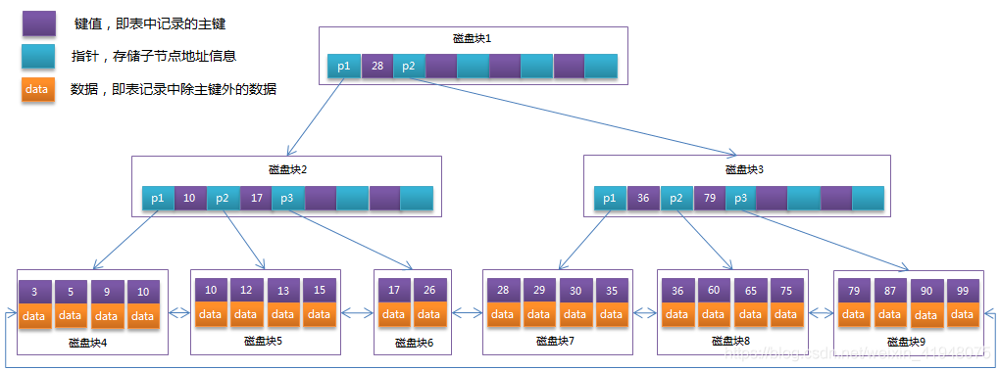

# MySQL索引
索引是创建在表上的，是对数据库表中一列或多列的值进行排序的一种数据结构，可以提高查询速度。
索引类似于书籍目录，通过翻找目录，提取标题，可以快速定位到对应的章节。

索引的优点:  
1. 加快检索速度
2. 唯一索引确保数据唯一性

索引的缺点:  
1. 索引存储占用空间
2. 增加、删除和修改数据时，也需要动态地维护索引

## 数据结构
MySQL 索引相关的数据结构有两种，一种是 B+Tree，一种是 Hash，大多数情况下都使用 B+Tree 索引。

### Hash表
哈希表是键值对的集合，底层实现是基于数组和链表。

原理是对索引的 `key` 进行一次 `Hash` 计算就可以定位出数据存储的位置，但仅支持 `=` 和 `IN` ，不支持范围查询(因为无序)，同时数据库大数据存储时容易产生 `Hash` 冲突。

### B+Tree
这里先简单介绍下B-Tree和B+Tree，B-Tree全称多路平衡查找树，B+Tree是B-Tree的一种变体，这里的B指的Balanced(平衡)的意思。
目前大部分数据库系统及文件系统都采用 B-Tree 或其变种 B+Tree 作为索引结构。



区别  
1. B-Tree的所有节点既存放键(key) 也存放数据(data)，而 B+Tree只有叶子节点存放 key 和 data，其他非叶子节点只存放 key。
由于磁盘块的空间是有限的，非叶子节点占用内存越小，节点数越多，树的高度也越低，IO次数也就越低，检索性能也就越好。
2. B-Tree的叶子节点都是独立的，而B+Tree的叶子节点有一条引用链指向与它相邻的叶子节点。
因此B+Tree的范围查询仅需要遍历链表，而B-Tree则需要先找到边界值，再进行树的遍历，而树的遍历则又涉及多个磁盘块，增加了IO操作次数。

这里需要补充一个知识点，为什么树的深度越深，IO次数越多。
树的高度越低，那么从根节点到叶子节点的路径上经过的磁盘块数量就越少。每个磁盘块都需要加载到内存中进行操作，而且每次内存访问都需要消耗一定的时间。
因此，树的高度越低，查询时需要进行的内存访问次数就越少，从而降低了查询时需要进行的磁盘 I/O 操作次数。

### 聚簇索引和非聚簇索引
1. 聚簇索引  
   叶子节点存储的data是该行数据，主键索引就是典型的聚簇索引
2. 非聚簇索引  
   叶子节点存储的data是主键ID，因此还需要一次回表查询

所以这里有一个知识点，非聚簇索引查询需要多加一次回表查询，
但是假如创建的组合索引涵盖了需要查询的字段，那么则无需回表查询，这种特殊的组合索引又称之为覆盖索引。

### 最左前缀匹配原则
所谓最左原则指的就是如果你的 SQL 语句中用到了联合索引中的最左边的索引，那么这条 SQL 语句就可以利用这个联合索引去进行匹配，
值得注意的是，当遇到范围查询(>、<、between、like)就会停止匹配。

因此当已经有了(a,b)这个联合索引后，一般就不需要单独在a上建立索引了。
如果通过调整顺序，可以少维护一个索引，那么这个顺序往往就是需要优先考虑采用的。

```sql
-- (a,b,c),(b,a,c),(c,a,b)等都可以，因为优化器会调整顺序
SELECT * FROM table WHERE a = 1 and b = 2 and c = 3;
-- (b,a)
SELECT * FROM table WHERE a > 1 and b = 2;
-- (b,a) 或者 (b,c)
SELECT * FROM table WHERE a > 1 and b = 2 and c > 3;
-- (a,b)
SELECT * FROM table WHERE a = 1 ORDER BY b;
-- (a)
SELECT * FROM table WHERE a > 1 ORDER BY b;
-- (a,b)
SELECT * FROM table WHERE a IN (1,2,3) and b > 1;
```

### 前缀索引
使用前缀索引，定义好合适的长度(参考指定长度的区分度)，就可以做到既节省空间，又不用额外增加太多的查询成本。  
使用前缀索引有可能会用不上覆盖索引对于查询的优化。
